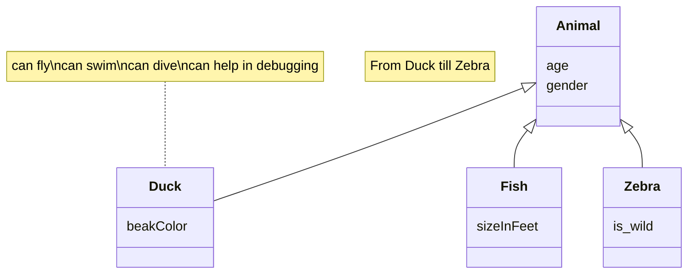

# Documento de análisis de requisitos del sistema
**Asignatura:** Diseño y Pruebas (Grado en Ingeniería del Software, Universidad de Sevilla)  
**Curso académico:** 2025/2026 
**Grupo/Equipo:** L4-04  
**Nombre del proyecto:** Saboteur 
**Repositorio:** (https://github.com/gii-is-DP1/dp1-2025-2026-l4-4-25/tree/main)
**Integrantes (máx. 6):** <!-- Nombre Apellidos (US-Id / correo @us.es) -->

_Esta es una plantilla que sirve como guía para realizar este entregable. Por favor, mantén las mismas secciones y los contenidos que se indican para poder hacer su revisión más ágil._ 

## Introducción

_En esta sección debes describir de manera general cual es la funcionalidad del proyecto a rasgos generales. ¿Qué valor puede aportar? ¿Qué objetivos pretendemos alcanzar con su implementación? ¿Cuántos jugadores pueden intervenir en una partida como máximo y como mínimo? ¿Cómo se desarrolla normalmente una partida?¿Cuánto suelen durar?¿Cuando termina la partida?¿Cuantos puntos gana cada jugador o cual es el criterio para elegir al vencedor?_

· 

Enlace al vídeo de explicación de las reglas del juego / partida jugada por el grupo](https://www.youtube.com/watch?v=lwxIUdtN4aE)

## Tipos de Usuarios / Roles

**1 · Administrador**: Rol que gestiona los logros, partidas, usuarios, estadisticas, etc.
    
**2 · Usuario**: Rol base de cualquier persona que entra en el juego, accesibilidad a toda la UI de Usuario, con posibilidad de jugar en partidas, ver sus propias estadisticas, etc.

**2.1 · Espectador**: Tipo de rol de usuario que visualiza una partida, sin posibilidad de interactuar en la misma.

**2.2 · Saboteur**: Tipo de rol de usuario que dentro de una partida se asigna de forma aleatoria en base a las Reglas de Negocios ya definidas, el papel de los mismos es de obstaculizar el paso y la jugabilidad de los Mineros, impidiendo así que llegan a la carta de las _pepitas de oro_.

**2.3 · Minero**: Tipo de rol de usuario que dentro de una partida se asigna de forma aleatoria en base a las Reglas de Negocios ya definidas, el papel de los mismos es el de llegar a la carta pepitas de oro sin ser saboteados.

## Historias de Usuario

A continuación se definen  todas las historias de usuario a implementar:
_Os recomentamos usar la siguiente plantilla de contenidos que usa un formato tabular:_
 ### HU-(ISSUE#ID): Nombre ([Enlace a la Issue asociada a la historia de usuario]()
|Descripción de la historia siguiendo el esquema:  "Como <rol> quiero que el sistema <funcionalidad>  para poder <objetivo/beneficio>."| 
|-----|
|Mockups (prototipos en formato imagen de baja fidelidad) de la interfaz de usuario del sistema|
|Decripción de las interacciones concretas a realizar con la interfaz de usuario del sistema para lleva a cabo la historia. |

## Diagrama conceptual del sistema
_En esta sección debe proporcionar un diagrama UML de clases que describa el modelo de datos a implementar en la aplicación. Este diagrama estará anotado con las restricciones simples (de formato/patrón, unicidad, obligatoriedad, o valores máximos y mínimos) de los datos a gestionar por la aplicación. _

_Recuerde que este es un diagrama conceptual, y por tanto no se incluyen los tipos de los atributos, ni clases específicas de librerías o frameworks, solamente los conceptos del dominio/juego que pretendemos implementar_
Ej:

_Si vuestro diagrama se vuelve demasiado complejo, siempre podéis crear varios diagramas para ilustrar todos los conceptos del dominio. Por ejemplo podríais crear un diagrama para cada uno de los módulos que quereis abordar. La única limitación es que hay que ser coherente entre unos diagramas y otros si nos referimos a las mismas clases_

_Puede usar la herramienta de modelado que desee para generar sus diagramas de clases. Para crear el diagrama anterior nosotros hemos usado un lenguaje textual y librería para la generación de diagramas llamada Mermaid_

_Si deseais usar esta herramienta para generar vuestro(s) diagramas con esta herramienta os proporcionamos un [enlace a la documentación oficial de la sintaxis de diagramas de clases de _ermaid](https://mermaid.js.org/syntax/classDiagram.html)_

## Reglas de Negocio
### R-< X > < Nombre Regla de negocio >
_< Descripción de la restricción a imponer >_

_Ej:_ 
### R1 – Diagnósticos imposibles
El diagnóstico debe estar asociado a una enfermedad que es compatible con el tipo de mascota de su visita relacionada. Por ejemplo, no podemos establecer como enfermedad diagnosticada una otitis cuando la visita está asociada a una mascota que es un pez, porque éstos no tienen orejas ni oídos (y por tanto no será uno de los tipos de mascota asociados a la enfermedad otitis en el vademecum).

…

_Muchas de las reglas del juego se transformarán en nuestro caso en reglas de negocio, por ejemplo, “la carta X solo podrá jugarse en la ronda Y si en la ronda anterior se jugó la carta Z”, o “en caso de que un jugador quede eliminado el turno cambia de sentido”_

