# 📄Documento de análisis de requisitos del sistema📄
**Asignatura:** Diseño y Pruebas (Grado en Ingeniería del Software, Universidad de Sevilla)  
**Curso académico:** 2025/2026 
**Grupo/Equipo:** L4-4  
**Nombre del proyecto:** Saboteur 
**Repositorio:** (https://github.com/gii-is-DP1/dp1-2025-2026-l4-4-25/tree/main)
**Integrantes (máx. 6):** <!-- Nombre Apellidos (US-Id / correo @us.es) -->

Alejandro Caro Pérez (FQY7185 / alecarper@alum.us.es)

Lorenzo Valderrama Román (WRG8176 / lorvalrom@alum.us.es)

Diego Rey Carmona (RHQ7780 / diereycar@alum.us.es)

Marcos Ángel Ayala Blanco (GBK4935 / marayabla@alum.us)

Carlos Borrego Ortiz (HKP3295 / carborort@alum.us.es)

Luis Calderón Carmona (JGR9196/ luicalcar@alum.us.es)

_Esta es una plantilla que sirve como guía para realizar este entregable. Por favor, mantén las mismas secciones y los contenidos que se indican para poder hacer su revisión más ágil._ 

## 1️⃣ Introducción

El valor que puede aportar nuestro Proyecto **Saboteur** es el de implementar un juego de mesa vía web / online en el que pueden jugar distintos jugadores **simultáneamente** y **gratuito**.
Los **objetivos** de dicha implementación es jugar de la misma manera que si jugáramos en persona.
Las partidas tendrán un **mínimo** de 3 jugadores hasta 12 jugadores entre los que se **repartirán** los roles definidos en las reglas de negocio.
Una vez asignados los roles y las cartas de cada uno, los **buscadores de oro** intentarán construir el camino hasta donde creen que están las **pepitas de oro** y los **saboteadores** tendrán que poner trabas para impedir que los buscadores puedan lograr su hazaña.

Las partidas suelen durar de **20 min a 30 min**. Dependiendo de lo rápido que los buscadores lleguen al oro o de que a estos se les agoten las cartas gracias a la eficacia de los saboteadores.
El vencedor será el jugador que **más** pepitas de oro haya conseguido.

Enlace al vídeo de explicación de las reglas del juego / partida jugada por el grupo](https://www.youtube.com/watch?v=lwxIUdtN4aE)

Las partidas suelen durar de **20 min a 30 min**. Dependiendo de lo rápido que los buscadores lleguen al oro o de que a estos se les agoten las cartas gracias a la eficacia de los saboteadores.
El vencedor será el jugador que **más** pepitas de oro haya conseguido.

#### · VIDEO EXPLICATIVO :

<a href="https://www.youtube.com/watch?v=lwxIUdtN4aE" style="display:inline-block;padding:10px 15px;background:#008aff;color:#fff;border-radius:5px;text-decoration:none;">
 🎞 PULSE PARA VER VIDEO
</a>

## 2️⃣ Tipos de Usuarios / Roles

- **Usuario**: Rol base de cualquier persona que entra en el juego, accesibilidad a toda la UI de Usuario, con posibilidad de jugar en partidas, ver sus propias estadisticas, etc.

**1 · Administrador**: Rol de usuario que gestiona los logros, partidas, usuarios, estadisticas, etc.

**2 · Espectador**: Tipo de rol de usuario que visualiza una partida, sin posibilidad de interactuar en la misma.

**3 · Participante**: Tipo de rol usuario que juega una partida. Este mismo puede ser dos diferentes roles:

>**3.1 · Saboteur**: Tipo de rol de usuario que dentro de una partida se asigna de forma aleatoria en base a las Reglas de Negocios ya definidas, el papel de los mismos es de obstaculizar el paso y la jugabilidad de los Mineros, impidiendo así que llegan a la carta de las _pepitas de oro_.

>**3.2 · Minero**: Tipo de rol de usuario que dentro de una partida se asigna de forma aleatoria en base a las Reglas de Negocios ya definidas, el papel de los mismos es el de llegar a la carta pepitas de oro sin ser saboteados.

## 3️⃣ Historias de Usuario

> 💡Para la mejor visualización de los mockups de las historias de usuario se recomienda acceder a este proyecto en [Figma](https://www.figma.com/design/BI3P30KquBHnIdXGmCalf6/Historias-de-Usuario?node-id=0-1&t=fptdwjEDXueObJTR-1).

 ### HU-1 (ISSUE#44): 🙍‍♂️🙍‍LOBBY ([Enlace ISSUE](https://github.com/gii-is-DP1/dp1-2025-2026-l4-4-25/issues/44))
|"Como jugador quiero que el sistema tenga un 'lobby' (menú principal) para que pueda acceder a distintas funciones como: botón para crear una partida, sección de amigos, acceso al perfil del jugador, ranking de jugadores, partidas en juego de tus amigos, notificaciones emergentes."| 
|-----|
|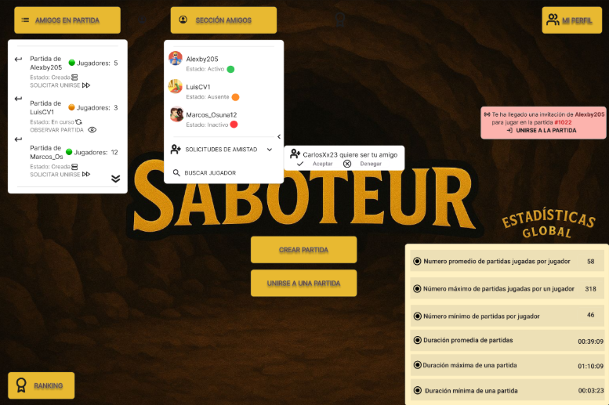|
| El mockup representa la pantalla principal o lobby del juego. Está diseñado con un fondo oscuro que simula la textura de una mina o túnel (coherente con la temática del juego). El título "SABOTEUR" aparece en el centro, en letras grandes, doradas y con un efecto brillante, funcionando como elemento central. La interfaz está organizada en módulos flotantes rectangulares con esquinas redondeadas y tonos claros (beige/amarillo), distribuidos alrededor del título central. Cada módulo muestra una funcionalidad clave: gestión de amigos, partidas, estadísticas, perfil, ranking, etc. A continuación se describirán los elementos por sección:
   El lobby se organiza en varias secciones. En la zona superior izquierda se encuentra el panel "AMIGOS EN PARTIDA", que muestra las partidas activas creadas por amigos. Cada partida se presenta en una tarjeta con el nombre del creador (ej. "Partida de Alejandro"), el número de jugadores, el estado ("Creada" o "En curso"), y botones de acción: "SOLICITAR UNIRSE" para partidas creadas y "ESPECTAR PARTIDA" para las que están en curso. Iconos de color (verde/naranja) indican la disponibilidad.
En la zona superior central se ubica la "SECCIÓN AMIGOS", que lista a los amigos con su estado actual (ej. Alejandro – Activo, Luis – Ausente, Marcos – Inactivo, con puntos de color verde, naranja y rojo, respectivamente). Esta sección incluye opciones para Solicitudes de amistad (desplegable) y Buscar jugador (barra de búsqueda), además de mostrar notificaciones (ej. "Carlos quiere ser tu amigo") tienes entonces la opcion de aceptar o denegar la solicitud de amistad. La zona superior derecha contiene el botón "MI PERFIL" y una notificación de invitación (rosa) de Alejandro para unirse a la partida #1022, con el botón de acción "UNIRSE A LA PARTIDA".
Las acciones principales del lobby se encuentran en la zona inferior central, destacadas con dos grandes botones amarillos: "CREAR PARTIDA" y "UNIRSE A UNA PARTIDA". En la zona inferior izquierda presenta un único botón con icono de trofeo para acceder al "RANKING" general de jugadores.En la zona inferior derecha se encuentra el panel "ESTADÍSTICAS GLOBALES", que muestra estadísticas de todas las partidas, como el promedio, máximo y mínimo de partidas jugadas por cada jugador (ej. 58 promedio) y la duración de las mismas (ej. 00:39:09 promedio). Cada estadistica apararece en fila, con fondo amarillo claro y texto en negro.

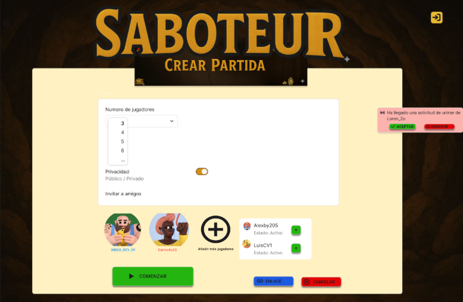

---

### HU-2 (ISSUE#45): ✏CREACIÓN DE PARTIDA ([Enlace ISSUE](https://github.com/gii-is-DP1/dp1-2025-2026-l4-4-25/issues/45))
| "Como jugador, quiero que el sistema aporte un menú de configuración de creación de la partida, para poder asignar el número de jugadores, invitar a amigos a unirse, e iniciar la partida cuando todo esté listo." 
|----| 
| |
| El menú de configuración para la **creación de las partidas** se hará desde una pantalla independiente y lo hará un solo usuario, que será el anfitrión de la misma. Observaremos un formulario de creación de partida donde encontramos las siguientes opciones obligatorias: **Número de jugadores** (siendo 3 el mínimo de jugadores y el máximo de 12 jugadores, incluyendo al anfitrión) y la **privacidad** (público: pueden unirse sin invitación previa, privado: para unirse se requiere de una invitación previa). Además, encontramos la opción para **invitar a nuestros amigos que estén conectados**. En la parte inferior veremos los usuarios que están unidos para jugar en la partida, teniendo opción para **añadir a más jugadores.** También el anfitrión tendrá la posibilidad de **aceptar / rechazar las peticiones** de unirse a la partida. Para comenzar la partida debemos pulsar el botón de comenzar, también se tendrá la posibilidad de **cancelar** la partida o de compartir un **enlace** para unirte a la partida. |

### HU-3 (ISSUE#46): 📝LISTADO DE PARTIDAS JUGADORES  ([Enlace ISSUE](https://github.com/gii-is-DP1/dp1-2025-2026-l4-4-25/issues/46))
| "Como jugador, quiero poder ver todas las partidas creadas o que se están jugando actualmente, para poder unirme a una de ellas o esperar hasta que finalice." 
|----| 
| |
| En la pantalla se muestra todas las partidas que han sido creadas o que están siendo jugadas, esto hace posible que un jugador se una a cualquiera que ha sido creada en público y no ha comenzado a través de los botones correspondientes, así como para esperar a que esta finalice. |

### HU-4 (ISSUE#47): 🎫UNIRSE A PARTIDA CREADA  ([Enlace ISSUE](https://github.com/gii-is-DP1/dp1-2025-2026-l4-4-25/issues/47))
| "Como jugador, quiero tener la opción de unirme a una partida creada que no ha sido iniciada y tenga espacio para más jugadores, para jugar una partida." 
|----| 
| 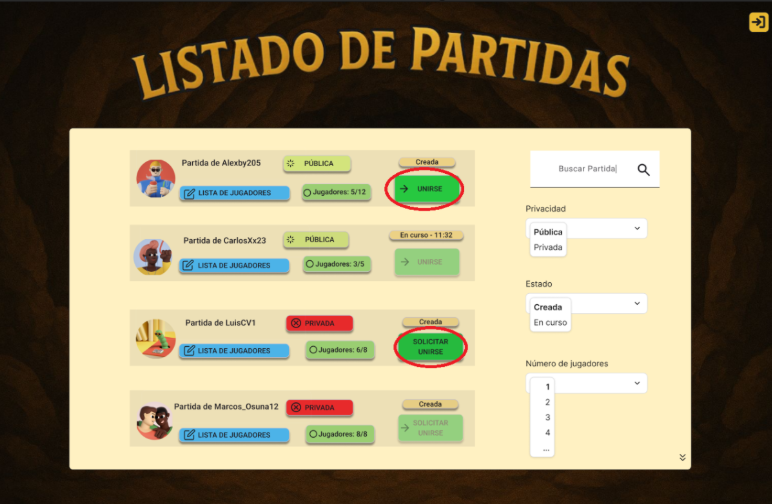|
| Dentro de la anterior historia de usuario, en la pantalla de todas las partidas creadas tendremos la opción para unirse a una partida, esta no deberá de haber sido iniciada y tiene que tener espacios libres para poder pertenecer a la misma. |

### HU-5 (ISSUE#48): 🎭ASIGNACIÓN DE ROLES  ([Enlace ISSUE](https://github.com/gii-is-DP1/dp1-2025-2026-l4-4-25/issues/48))
| "Como jugador, quiero que el sistema asigne roles secretos (minero o saboteador) al inicio de la partida y que se base en las estadísticas de asignación, para que el juego mantenga su forma impredecible y divertida." 
|----| 
| 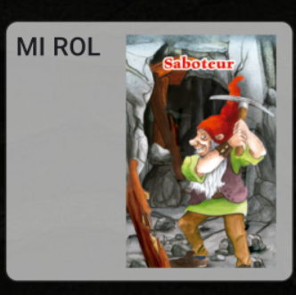|
| La asignación de roles secretos (minero o saboteador) se hará justo al comenzar la partida según los jugadores que haya en la misma y que está definido posteriormente en las Reglas de Negocio. Esta aparecerá en nuestra interfaz de juego (para cada jugador en privado) y nunca será revelada a otros jugadores. |

### HU-6 (ISSUE#49): 🧩VISIÓN DEL TABLERO  ([Enlace ISSUE](https://github.com/gii-is-DP1/dp1-2025-2026-l4-4-25/issues/49))
| "Como jugador, quiero que el sistema permita ver el tablero en tiempo real para poder idear una estrategia." 
|----| 
| 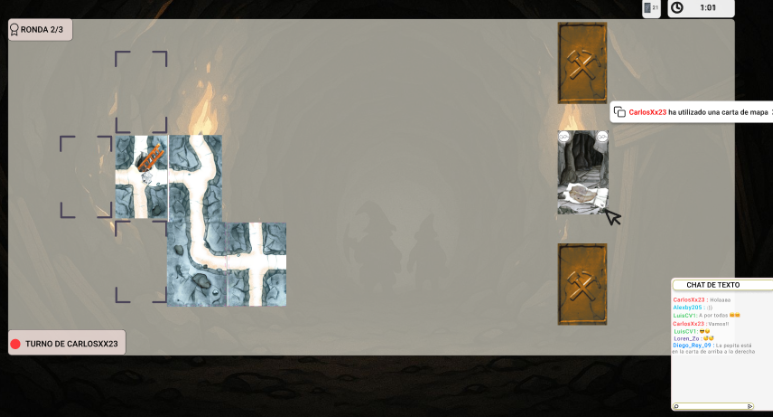|
| Dentro de la interfaz del juego, podemos observar el tablero en tiempo real con todos los cambios y movimientos actualizados en tiempo real, al inicio de esta nos indica los posibles movimientos que podemos realizar. **Nota:** La carta de mapa solo puede verla el jugador que la ha invocado. |

### HU-7 (ISSUE#50): 🙍‍♂️VISIÓN DE LOS JUGADORES  ([Enlace ISSUE](https://github.com/gii-is-DP1/dp1-2025-2026-l4-4-25/issues/50))
| "Como jugador, quiero que el sistema tenga una sección de usuarios en la interfaz de la partida para ver los jugadores que están jugando la partida." 
|----| 
| 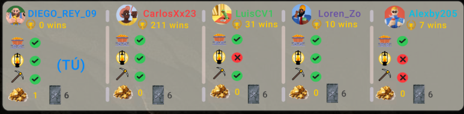|
| En la interfaz del tablero, en la parte superior derecha encontramos la sección de los jugadores, donde podremos ver todos los jugadores que se encuentran en nuestra partida (solo aquellos que están jugando, el espectador queda excluyente de esto). Se visualiza la foto de perfil y el nombre de usuario de cada jugador, además en la parte inferior de este nos encontramos con el número de victorias totales de cada jugador. |

### HU-8 (ISSUE#51): ⛏VISIÓN DE LAS HERRAMIENTAS  ([Enlace ISSUE](https://github.com/gii-is-DP1/dp1-2025-2026-l4-4-25/issues/51))
| "Como jugador, quiero que el sistema permita ver el estado de las herramientas de todos los jugadores, para decidir una estrategia." 
|----| 
| 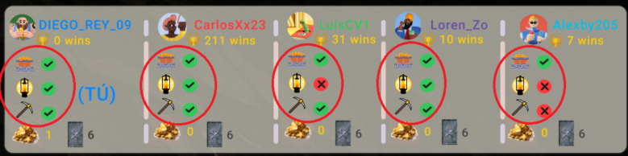|
| En la sección de jugadores de la partida se puede ver el estado de herramientas de cada jugador. Las herramientas marcadas con un tick verde se encuentran funcionales, mientras que las herramientas marcadas con una "x" roja están indicando que otro jugador ha roto esa herramienta. Este elemento de la interfaz de usuario no es interactivo, es visual, su función es indicar al resto de jugadores el estado de las herramientas de los demás para que se puedan elaborar distintas estrategias. En este caso, nos fijamos como el jugador “DIEGO_REY_09” tiene todas sus herramientas funcionales, mientras que el jugador “Alexby205” tiene dos de sus herramientas rotas (pico y candil) dando a entender que el resto de jugadores piensan que es un saboteador.|

### HU-9 (ISSUE#52): 🃏VISIÓN DEL MAZO  ([Enlace ISSUE](https://github.com/gii-is-DP1/dp1-2025-2026-l4-4-25/issues/52))
| "Como jugador, quiero que el sistema me permita ver el mazo con el que estoy jugando en ese instante, para poder jugar con precisión, controlar mis cartas disponibles y planificar mejor mis movimientos durante la partida." 
|----| 
| 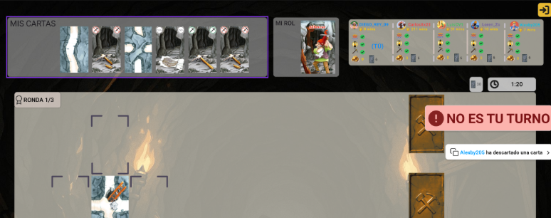|
| En la interfaz de la partida se muestra un recuadro nombrado “Mis cartas”,donde será visible el mazo del jugador en tiempo real .|

### HU-10 (ISSUE#53): 🀄VISIÓN DEL NÚMERO DE CARTAS EN LA MANO  ([Enlace ISSUE](https://github.com/gii-is-DP1/dp1-2025-2026-l4-4-25/issues/53))
| "Como jugador, quiero que el sistema tenga para cada jugador, junto a las cartas de acción de acción, un contador de cartas que tiene en la mano visible para todos los jugadores, para poder saber cuánto falta para que el jugador termine la partida e idear posibles estrategias." 
|----| 
| 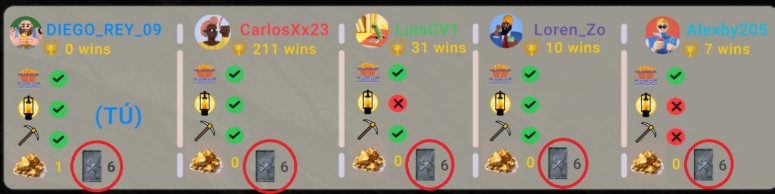|
| En la interfaz de la partida se muestra en la sección de jugadores una imagen con el diseño trasero de una carta del juego y justo a la derecha el contador de cartas que cada jugador tiene en la mano. |

### HU-11 (ISSUE#55): ⛏CONTADOR DE CARTAS DE ROBO  ([Enlace ISSUE](https://github.com/gii-is-DP1/dp1-2025-2026-l4-4-25/issues/55))
| "Como jugador, quiero que el sistema indique cuántas cartas quedan en el montón donde se roba en cada turno del jugador, para poder elaborar estrategias del juego y tener en cuenta cuándo puede llegar la ronda a su fin." 
|----| 
| 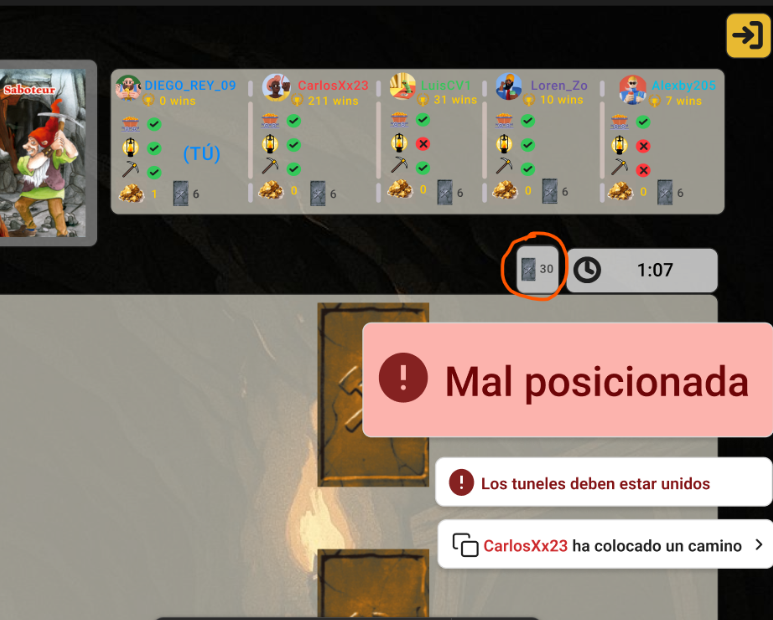|
| En la interfaz de la partida se muestra en la esquina superior derecha, junto a una imagen con el diseño trasero de las cartas del juego, un contador que indica cuántas cartas quedan en el montón de robo.|

### HU-12 (ISSUE#56): 1️⃣INDICADOR DE RONDA ([Enlace ISSUE](https://github.com/gii-is-DP1/dp1-2025-2026-l4-4-25/issues/56))
| "Como jugador, quiero que el sistema indique la ronda que se está jugando y la transición entre rondas, para no perder la linealidad de la partida por posibles despistes." 
|----| 
| 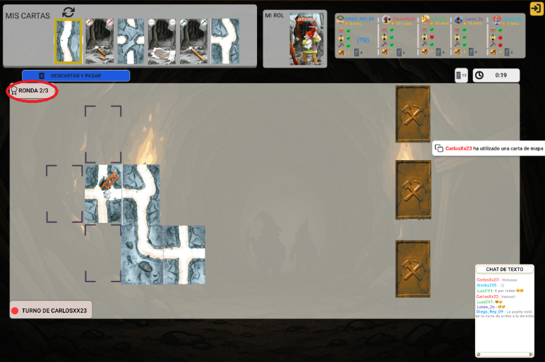|
| En la interfaz de la partida se muestra en la esquina superior izquierda qué ronda es la actual. Ej: 2/3 (ronda 2 de 3 rondas)|

### HU-13 (ISSUE#57): ⏰CONTADOR DE TIEMPO DE TURNO   ([Enlace ISSUE](https://github.com/gii-is-DP1/dp1-2025-2026-l4-4-25/issues/57))
| "Como jugador, quiero que el sistema muestre al jugador del que sea el turno un contador con minutero y segundero descendientes para indicar cuánto tiempo les queda para jugar su turno." 
|----| 
| 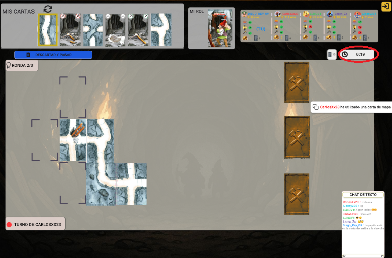|
| En la interfaz de la partida se muestra en la esquina superior derecha (junto con el contador de cartas del montón de robo) un temporizador que indica cuánto tiempo restante tiene el jugador del turno para jugarlo.|

### HU-14 (ISSUE#58): 📢AVISOS DE TURNO  ([Enlace ISSUE](https://github.com/gii-is-DP1/dp1-2025-2026-l4-4-25/issues/58))
| "Como jugador, quiero que el sistema tenga un indicador de quién es el turno, para no perder el tiempo ni la continuidad en la partida." 
|----| 
| 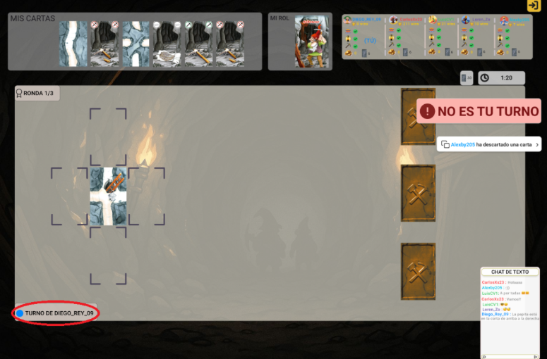|
| En la interfaz de la partida en la esquina inferior izquierda se muestra el nombre del jugador al que corresponde el turno, en este caso con un punto azul al ser este el color del jugador.|

### HU-15 (ISSUE#59): 💎VISIÓN DE CONTADOR DE PEPITAS  ([Enlace ISSUE](https://github.com/gii-is-DP1/dp1-2025-2026-l4-4-25/issues/59))
| "Como jugador, quiero que el sistema me permita ver las pepitas que han estado acumulando cada jugador a lo largo de los turnos, para que todos los jugadores tengan claro quién va ganando la partida." 
|----| 
| 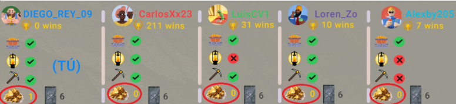|
| En la interfaz de usuario de la partida se muestra una sección de jugadores donde aparece reflejada la situación de cada uno durante la partida (estado de sus herramientas, victorias acumuladas, número de cartas en mano y contador de pepitas). Nos fijamos concretamente en el contador de pepitas de cada jugador para ver quién va ganando la partida. En este caso, el jugador “DIEGO_REY_09” ya tiene acumulado en su contador 1 pepita, por lo que va ganando la partida.|

### HU-16 (ISSUE#60): 🎴INTERACCIÓN CON LAS CARTAS DEL MAZO  ([Enlace ISSUE](https://github.com/gii-is-DP1/dp1-2025-2026-l4-4-25/issues/60))
| "Como jugador, quiero que el sistema me permita interactuar con las cartas de mi mazo, es decir, colocar túneles, lanzar cartas de acción y descartar cartas, para poder gestionar mis recursos (cartas) de manera precisa y responder a las jugadas de los demás jugadores. " 
|----| 
| |
| En la interfaz de usuario de la partida podemos comprobar que se nos está permitiendo interactuar en la partida (siempre y cuando nos encontremos en nuestro turno, como se puede ver) mediante un rectángulo de color amarillo que rodea a las cartas de la mano del jugador cuando este va a usarlas en el tablero. |

### HU-17 (ISSUE#61): 👓VISIÓN DE CARTAS JUGADAS ([Enlace ISSUE](https://github.com/gii-is-DP1/dp1-2025-2026-l4-4-25/issues/61))
| "Como jugador, quiero que el sistema permita ver las cartas jugadas en tiempo real, como las cartas de túnel o de acción que cada jugador lanza, para poder actuar siempre en el contexto de la partida. " 
|----| 
| 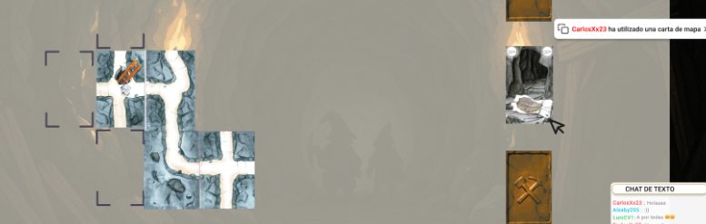|
| En este mockup podemos observar como la interfaz de usuario de la partida permite la visión de las cartas que se han ido jugando a lo largo del turno, mostrando el formato de carta correspondiente (túnel o acción) en pantalla. Las cartas túnel se muestran en el centro de la pantalla, las cartas de acción como “destrucción de túnel” o “mapa” también son mostradas en este lugar; mientras que, las cartas de “destrucción de herramientas” se hacen visibles cuando son asignadas al jugador correspondiente. |

### HU-18 (ISSUE#62): 💻REGISTRO DE ACCIONES ([Enlace ISSUE](https://github.com/gii-is-DP1/dp1-2025-2026-l4-4-25/issues/62))
| "Como jugador, quiero que el sistema muestre un registro (log) que se actualice en tiempo real con todas las jugadas que se han realizado durante el turno (y quién las ha realizado), para no perder el ritmo de la partida y poder tener una prueba en la que basar las suposiciones."   
|----| 
| 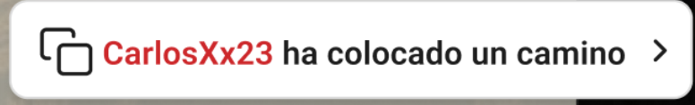|
| Para la visualización del registro de jugadas en tiempo real se ha utilizado un componente desplegable colocado en el lateral derecho de la pantalla principal de juego. Se mostrará la última jugada realizada, pero, si se despliega el elemento, se obtendrá el registro por orden temporal (de más reciente a más antiguo) de las jugadas realizadas durante la partida. |

### HU-19 (ISSUE#63): ⚠RESTRICCIÓN DE MOVIMIENTOS ILEGALES ([Enlace ISSUE](https://github.com/gii-is-DP1/dp1-2025-2026-l4-4-25/issues/63))
| "Como jugador, quiero que el sistema no me permita realizar un movimiento cuando dicho movimiento sea un movimiento ilegal (carta en posición incorrecta, continuar un camino cuando hay un segmento destruido, utilizar una carta de acción indebida, etc) para que no se incumplan las reglas del juego." 
|----| 
| 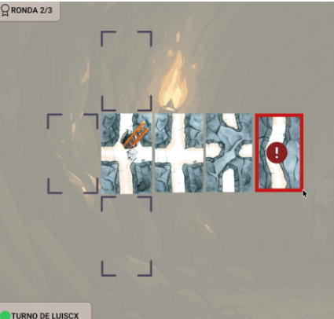|
| Cuando se realice un movimiento ilegal, la lógica del sistema no permitirá que esa carta quede sobre el tablero, pero, además, la interfaz de usuario rodeará la carta implicada en el movimiento ilegal de color rojo, indicando que la carta no va ser posicionada (o jugada en otro caso distinto al de este mockup) en ese lugar, puesto a que ese movimiento sigue las reglas de negocio. |

### HU-20 (ISSUE#64): ❗AVISO DE MOVIMIENTOS ILEGALES ([Enlace ISSUE](https://github.com/gii-is-DP1/dp1-2025-2026-l4-4-25/issues/64))
| "Como jugador, quiero que el sistema me alerte cuando intente hacer un movimiento ilegal (carta en posición incorrecta, continuar un camino cuando hay un segmento destruido, utilizar una carta de acción indebida, etc) para conocer mi error."
|----| 
| 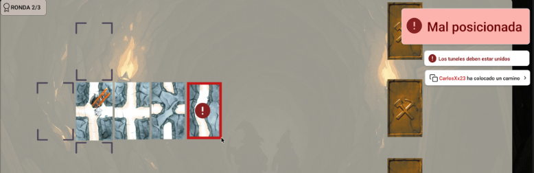|
| En este caso, cuando se realice un movimiento ilegal por parte de un determinado jugador, la interfaz gráfica avisará a dicho jugador de que su movimiento no podrá llevarse a cabo, indicando, además, la causa por la que esa jugada no es válida. Las notificaciones aparecerán en el lateral derecho de la pantalla principal de juego, resaltando especialmente (con fondo rojo, letras rojas y mayor tamaño) la notificación más nivel de abstracción, seguida (con un tamaño menor) de la descripción con más bajo nivel de abstracción. Además, la carta que haya provocado este incumplimiento de restricciones será señalada con un símbolo de alerta blanco con fondo rojo.  |

### HU-21 (ISSUE#65): 👁VISUALIZACIÓN DEL LISTADO DE PARTIDAS([Enlace ISSUE](https://github.com/gii-is-DP1/dp1-2025-2026-l4-4-25/issues/65))
| "Como jugador, quiero visualizar el listado de partidas que he creado y jugado, para consultar mi historial y acceder fácilmente a las partidas anteriores." 
|----| 
| 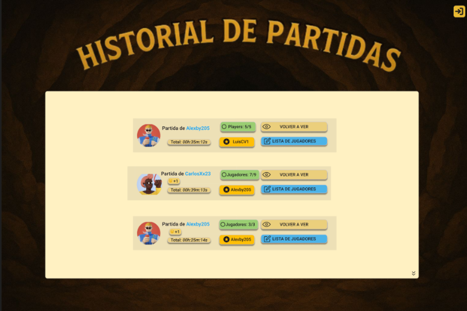|
| En este caso, la interfaz de usuario ofrece una lista con las partidas jugadas del jugador, incluyendo las que este ha creado y en las que ha participado. Se mostrará el tiempo total que duró cada partida, así como el número de jugadores y el ganador de la partida. Además, presentará dos botones: “Volver a ver”, que te devuelve el “log” o registro de las jugadas de los jugadores de esa partida (en formato .txt) y “Lista de jugadores” que devuelve un modal que lista a todos los jugadores que participaron en dicha partida. |

### HU-22 (ISSUE#67): 🎮PARTIDAS JUGADAS ([Enlace ISSUE](https://github.com/gii-is-DP1/dp1-2025-2026-l4-4-25/issues/67))
| "Como administrador, quiero obtener un listado de las partidas jugadas y sus participantes, para supervisar la actividad del sistema y analizar la participación de los usuarios. "  
|----| 
| 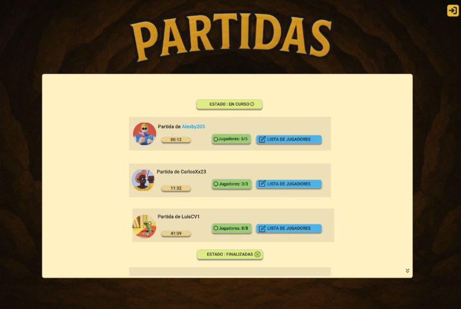|
| En este caso de diseño de interfaz concreto, podemos ver un componente que indica el estado de las partidas que se mostrarán listadas (en este caso se mostrarán las partidas en curso, pero también existe el estado “Finalizada”). Las partidas listadas mostrarán información relevante para el administrador, como el tiempo en curso (o el tiempo que duró la partida), el número de jugadores y el listado de los jugadores. Este último se hará posible mediante un botón que llamará a un modal con el listado de jugadores. De esta forma el administrador podrá gestionar y analizar la participación de los jugadores. |

### HU-23 (ISSUE#68): 🎇VISIÓN DE CARTAS DE ACCIÓN ([Enlace ISSUE](https://github.com/gii-is-DP1/dp1-2025-2026-l4-4-25/issues/68))
| "Como jugador, quiero que el sistema me muestre a qué jugadores puedo afectar con mis cartas de acción, para decidir mejor mi estrategia." 
|----| 
| 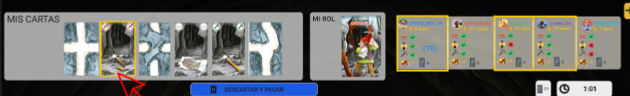|
| En esta imagen podemos observar como la interfaz de usuario me permite saber a qué jugadores puedo afectar si uso la carta de “destrozar herramienta - pico”. Al pulsar con el cursor sobre la carta, esta adquiere bordes amarillos indicando que está seleccionada, además, también adquieren bordes amarillos los jugadores en la sección de jugadores de la interfaz a los que esta carta puede afectar (en este caso, a todos los jugadores que tienen sus picos funcionales). En este caso, como el jugador “CarlosXx22” es el que está lanzando esa carta, su estado de jugador no adquiere bordes amarillos a pesar de tener también el pico funcional, pues no se puede echar esa carta a él mismo. |

### HU-24 (ISSUE#69): 📥REGISTROS DE JUGADOR ([Enlace ISSUE](https://github.com/gii-is-DP1/dp1-2025-2026-l4-4-25/issues/69))
| "Como jugador, quiero poder registrarme (sign-up), para poder acceder de forma segura a la aplicación." 
|----| 
| 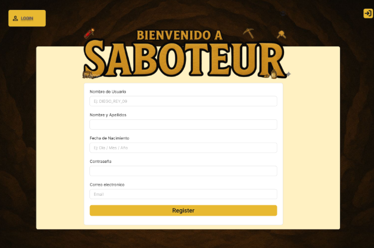|
| Para el registro de un nuevo jugador, se mostrará una ventana en la interfaz de usuario con un formulario como componente. Los campos del formulario serán: “Nombre de Usuario”, “Nombre y Apellidos”, “Fecha de nacimiento”, “Contraseña” y “Correo electrónico”. Además, contará con un botón para confirmar los datos y enviarlos a la base de datos llamado “Register” |

### HU-25 (ISSUE#70): 📩INICIO DE SESIÓN ([Enlace ISSUE](https://github.com/gii-is-DP1/dp1-2025-2026-l4-4-25/issues/70))
| "Como jugador, quiero poder iniciar sesión (login), para poder mantener mi información personal y continuar mis partidas y estadísticas."  
|----| 
| 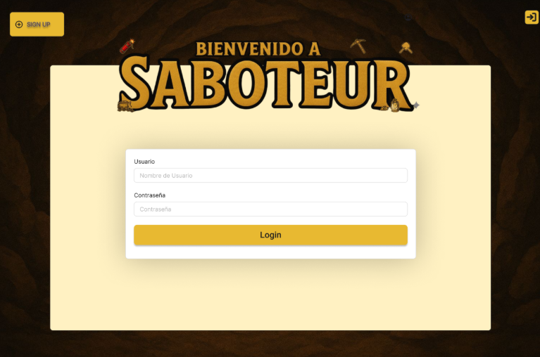|
| Para iniciar sesión se nos mostrará un formulario con los campos usuario y contraseña a rellenar. Estos campos tienen los valores “Nombre de Usuario” y “Contraseña” propios del usuario que se registró previamente. Pulsaremos Login para finalizar el proceso de inicio de sesión y confirmar la autenticación en el backend. |

### HU-26 (ISSUE#71): ❌CIERRE DE SESIÓN ([Enlace ISSUE](https://github.com/gii-is-DP1/dp1-2025-2026-l4-4-25/issues/71))
| "Como jugador, quiero poder cerrar sesión (logout), para poder proteger mi cuenta cuando deje de usar la aplicación." 
|----| 
| 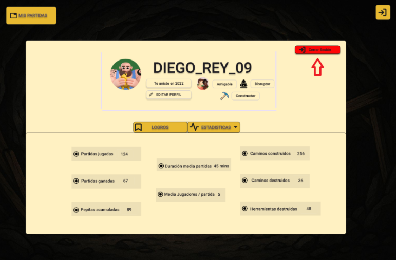|
| 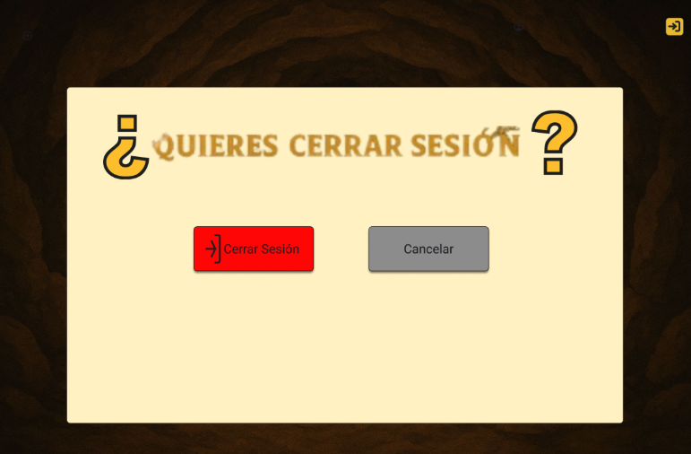|
| Como se puede ver, la interfaz de usuario permite el cierre de sesión del jugador mediante dos botones, un botón para cerrar la sesión (con fondo rojo) y un botón para cancelar esta acción (con fondo gris). Una vez pulsado el botón de cerrar sesión, la interfaz de usuario lanzará un modal de confirmación para que el usuario decida definitivamente el cierre de su sesión. |

### HU-27 (ISSUE#72): ✏EDICIÓN DEL PERFIL PERSONAL ([Enlace ISSUE](https://github.com/gii-is-DP1/dp1-2025-2026-l4-4-25/issues/72))
| "Como jugador, quiero poder editar mi perfil personal, para mantener mi información actualizada y correcta." 
|----| 
| 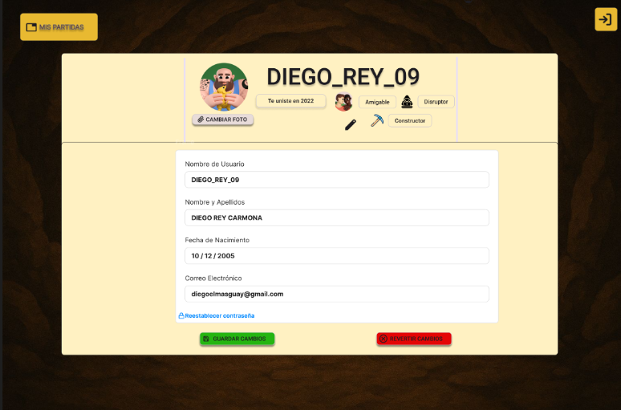|
| En este Mockup observamos un formulario con los datos correspondientes con nuestro perfil, estos son: el nombre de usuario, nombre y apellidos, fecha de nacimiento y correo electrónico. Todos estos campos son editables y,además, se podrá editar la foto de perfil. Estos datos pueden actualizarse pulsando el botón de “GUARDAR CAMBIOS”, o igualmente podemos revertir y regresar a los datos previos pulsando el botón de “REVERTIR CAMBIOS” |

### HU-28 (ISSUE#73): 📄LISTADO DE USUARIOS REGISTRADOS ([Enlace ISSUE](https://github.com/gii-is-DP1/dp1-2025-2026-l4-4-25/issues/73))
| "Como administrador, quiero obtener un listado paginado con todos los usuarios del juego registrados, para supervisar y gestionar fácilmente las cuentas de los usuarios del sistema." 
|----| 
| 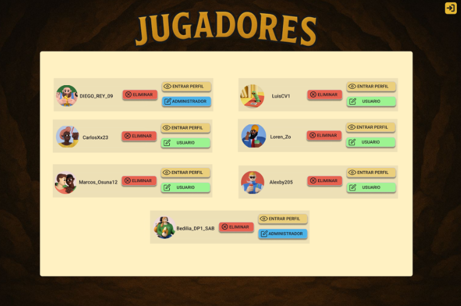|
| El administrador podrá revisar la lista de jugadores registrados. En esta lista el administrador podrá usar botones de roles de perfil (usuario/administrador) para asignar o quitar permisos de administración a los usuarios. Además, también se cuenta con botón de eliminación de usuario (con modal de confirmación) y botón de inspección del perfil. |

### HU-29 (ISSUE#74): 💻GESTIÓN DE USUARIOS (CRUD AVANZADO) ([Enlace ISSUE](https://github.com/gii-is-DP1/dp1-2025-2026-l4-4-25/issues/74))
| "Como administrador, quiero crear, leer, actualizar y eliminar  usuarios (o su respectiva información), con comprobación de seguridad y borrado en cascada de partidas, estadísticas y otros datos relacionados, para gestionar de forma segura y completa las cuentas de los usuarios del sistema." 
|----| 
| 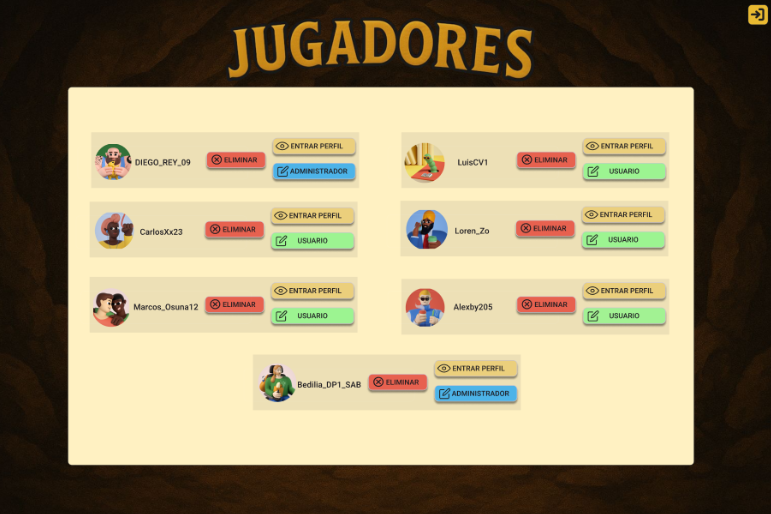|
| Esta interfaz de usuario es exclusiva para el administrador, siendo este el único en poder realizar las operaciones de actualización,eliminación y consulta de los usuarios. Estas operaciones las realizará desde el listado de usuarios registrados. Para la consulta y/o actualización de uno o varios usuarios accionará el botón de “Entrar Perfil” que le llevará a la interfaz del perfil de usuario pero con libre actualización de campos para el administrador, y para la eliminación presionará el botón “Eliminar” del usuario correspondiente. |

### HU-30 (ISSUE#75): 📊NÚMERO DE PARTIDAS ([Enlace ISSUE](https://github.com/gii-is-DP1/dp1-2025-2026-l4-4-25/issues/75))
| "Como jugador, quiero que el sistema tenga un registro de las partidas jugadas para poder ver cuántas partidas se han jugado de forma global y por usuario, incluyendo en ese caso promedios(media de las partidas jugadas por todos los usuarios), máximo (máximo de partidas jugadas entre todos los usuarios), mínimo (mínimo de todos los usuarios), etc." 
|----| 
| |
| Para ver la métrica de partidas jugadas, basta con entrar al apartado “Mi perfil”, darle al botón “Logros” y aparecerá la métrica con el número de partidas que has jugado.  |

### HU-31 (ISSUE#76): ⏰DURACIÓN DE LAS PARTIDAS ([Enlace ISSUE](https://github.com/gii-is-DP1/dp1-2025-2026-l4-4-25/issues/76))
| "Como jugador, quiero que el sistema tenga un registro de la duración de las partidas para poder ver la duración de las partidas de forma global y por usuario,  incluyendo en ese caso total, promedios, máximo, mínimo, etc." 
|----| 
| 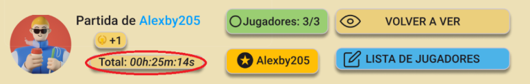|
| Para la consulta del tiempo total de una partida jugada por un jugador accederemos al historial de partidas y el tiempo invertido en la partida aparecerá como “Total: XYh:XYm:XYs” junto al perfil del jugador que participó en esta. |

### HU-32 (ISSUE#77): 📈NÚMERO DE JUGADORES POR PARTIDAS ([Enlace ISSUE](https://github.com/gii-is-DP1/dp1-2025-2026-l4-4-25/issues/77))
| "Como jugador, quiero que el sistema tenga un registro del número de jugadores por partida para poder ver el valor total, promedios, máximo y mínimo de jugadores por partida." 
|----| 
| 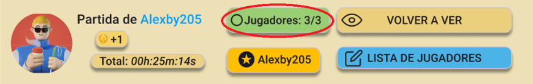|
| En cuanto a la consulta del número de jugadores de la partida, aparecerá de igual manera en el historial de partidas junto al perfil de uno de los jugadores participantes. Para consultar el resto de jugadores participantes de la misma deberemos accionar el botón de “Lista de Jugadores". |

### HU-33 (ISSUE#78): 📉ESTADISTICAS Y METRICAS ESPECIFICAS DE SABOTEUR ([Enlace ISSUE](https://github.com/gii-is-DP1/dp1-2025-2026-l4-4-25/issues/78))
| "Como jugador, quiero que el sistema registre y muestre métricas de la partida (cartas rotas, cartas arregladas, caminos rotos, frecuencia de ser saboteador, carta con oro por porcentaje y carta de camino más usada), para poder analizar el desarrollo de las partidas y comprender patrones de juego."
|----| 
| 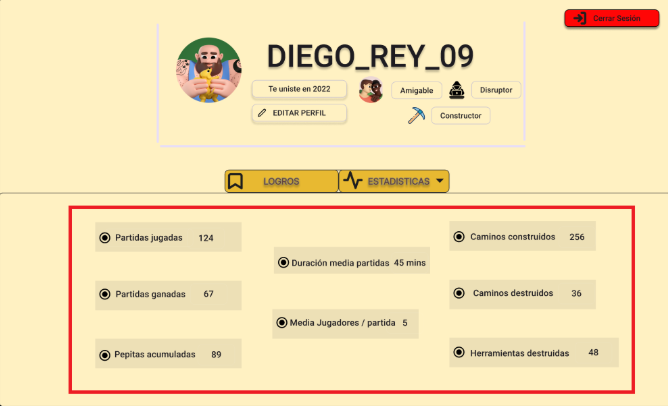|
| Para esta situación, se puede observar como la interfaz de usuario muestra en el perfil de cada jugador una sección de estadísticas accesible desde el botón “ESTADÍSTICAS” (en la imagen se muestra dicha sección rodeada con un recuadro rojo). En dicha sección se muestran elementos visuales (no interactivos) que indican las siguientes estadísticas del jugador: Partidas jugadas, Partidas ganadas, Pepitas acumuladas, Duración media de las partidas jugadas, Media de jugadores por partida con los que ha participado, Caminos construidos, Caminos destruidos y Herramientas destruidas.

### HU-34 (ISSUE#79): 🖊CRUD DE LOGROS ([Enlace ISSUE](https://github.com/gii-is-DP1/dp1-2025-2026-l4-4-25/issues/79))
| "Como administrador, quiero que el sistema tenga una interfaz de creación y otra de edición de logros, para mantener actualizados los logros disponibles y ofrecer a los jugadores nuevos retos de forma continua." 
|----| 
| 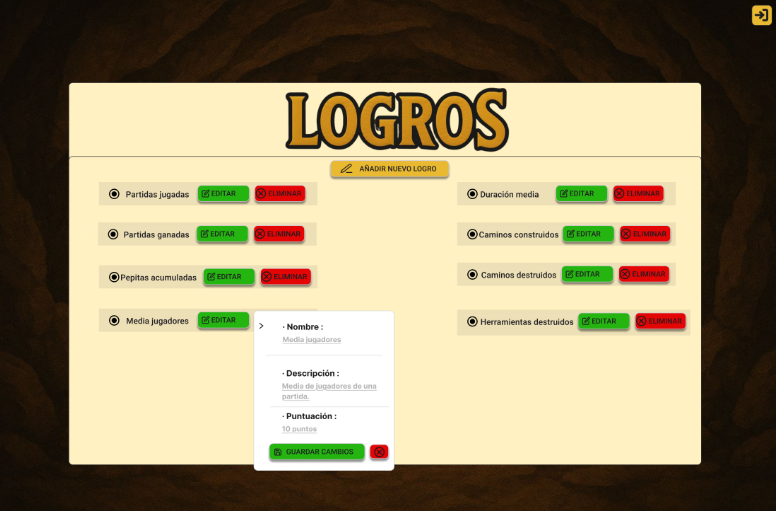|
| En este caso, se puede observar como la interfaz de usuario permite a un administrador añadir un nuevo logro, viéndose esta acción representada con el botón “AÑADIR NUEVO LOGRO" situado en el  centro de la pantalla. Además,  el administrador podrá editar un logro ya existente (botón de “EDITAR”) e incluso eliminarlo (botón de “ELIMINAR”). Una vez le da al botón de “EDITAR”, se le abrirá un modal para modificar los datos del logro (Nombre, Descripción y Puntuación)  y, una vez realizado los cambios, deberá confirmarlo dándole al botón “GUARDAR CAMBIOS”, o bien rechazar la acción cerrando dicho modal con el botón rojo con una “x”.  Si el administrador pulsa sobre el botón de “ELIMINAR” también aparecerá un modal de confirmación para llevar a cabo (o rechazar) esta acción. |

### HU-35 (ISSUE#81): 🏅RANKING DE JUGADORES: ([Enlace ISSUE](https://github.com/gii-is-DP1/dp1-2025-2026-l4-4-25/issues/81))
| "Como jugador, quiero que el sistema tenga un ranking de jugadores por distintas estadísticas como partidas ganadas totales, como saboteador o como minero; por puntos ganados, tiempo jugado y partidas jugadas para saber cuál es el ranking por cada estadística descrita." 
|----| 
| 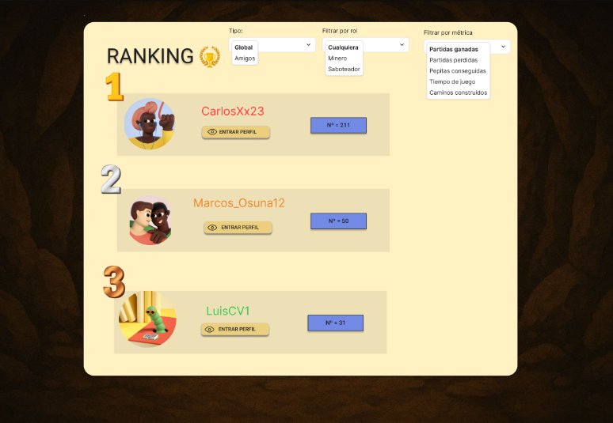|
| Para el ranking de jugadores, la interfaz de usuario nos ofrece un panel con distintos desplegables en la parte superior que actuarán como filtros del ranking. Estos filtros son: - Por tipo de ranking: Global (todos los jugadores registrados en el juego) o Amigos (solo amigos del jugador registrado que accede al ranking) - Por rol: muestra el ranking para las veces que los jugadores han actuado como mineros o como saboteadores de forma separada. - Por métrica: Permite mostrar el ranking de jugadores por partidas ganadas, partidas perdidas, número de pepitas de oro conseguidas, tiempo de juego y caminos construidos. |
Una vez aplicados los filtros se mostrarán los jugadores en el ranking, principalmente se mostrará el podio con los tres primeros, pero se podrá hacer “scroll” en la lista de jugadores. Cada jugador del ranking aparecerá identificado con su nombre de usuario y se mostrará un motón que nos permitirá navegar al perfil del jugador seleccionado. Además, aparecerá la cantidad conseguida por cada jugador según la métrica impuesta. En este caso, el usuario CarlosXx23 es el primero en el ranking global, filtrado por cualquier rol y en cuanto a partidas ganadas.
 

### HU-36 (ISSUE#82): 🎖LOGROS EN EL PERFIL DE USUARIO: ([Enlace ISSUE](https://github.com/gii-is-DP1/dp1-2025-2026-l4-4-25/issues/82))
| "Como jugador, quiero que en el perfil de cada usuario aparezcan los logros conseguidos para conocer qué logros tiene. "  
|----| 
| |
| Para consultar los logros de un jugador inspeccionamos su perfil, donde podremos  encontrar los logros conseguidos por el jugador y su progresión en los logros aún no obtenidos. La interfaz de usuario mostrará en el perfil del jugador la siguiente información visual: - Barra de navegación con dos pestañas: Logros y Estadísticas. - Dentro de Logros, aparecen diferentes categorías con barra de progreso:  ---- Constructor: 242 / 500 caminos construidos.  ---- Disruptor: 3 / 10 herramientas destruidas.  ---- Amigable: 15 / 20 amistades. |

### HU-37 (ISSUE#83): 🎭SECCIÓN DE AMIGOS: ([Enlace ISSUE](https://github.com/gii-is-DP1/dp1-2025-2026-l4-4-25/issues/83))
| "Como jugador, quiero que el sistema posea una sección de amigos para ver todos tus amigos, ver si están conectados o no y poder acceder a sus perfiles personales." 
|----| 
| 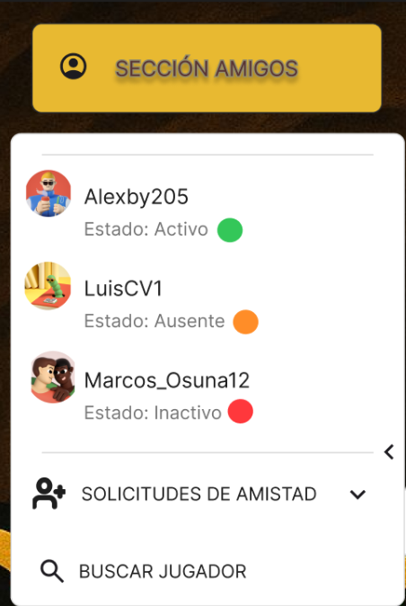|
| En este caso, la interfaz de usuario cuenta con un botón llamado “Sección de amigos”. Al pulsar sobre dicho botón se mostrará un componente (modal) con todos los amigos del jugador. Debajo del nombre de usuario de cada amigo, se indicará el estado en el que se encuentra: Activo (verde), Ausente (naranja) e Inactivo (rojo). Además, se presentará un desplegable que contendrá las solicitudes de amistad al jugador listadas, así como un buscador que permita introducir el nombre de un jugador para enviarle solicitud de amistad.

### HU-38 (ISSUE#84): ➕PETICIONES DE AMISTAD: ([Enlace ISSUE](https://github.com/gii-is-DP1/dp1-2025-2026-l4-4-25/issues/84))
| " Como jugador, quiero que el sistema tenga un buscador de otros jugadores por nombre de usuario para poder añadirlos como “amigos” dentro del juego."
|----| 
| |
| La interfaz de usuario presentará un elemento buscador en el que se podrá introducir texto para buscar a otros jugadores por su nombre de jugador y enviarles posteriormente una solicitud de amistad.

### HU-39 (ISSUE#85): ✅❎ACEPTAR O RECHAZAR SOLICITUDES DE AMISTAD ENTRANTES: ([Enlace ISSUE](https://github.com/gii-is-DP1/dp1-2025-2026-l4-4-25/issues/85))
| "Como jugador quiero que el sistema tenga un apartado de solicitudes de amistad entrantes para poder aceptar o rechazar cada solicitud."
|----| 
| 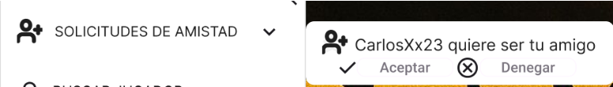|
| En este caso, la interfaz de usuario presenta un elemento desplegable en la sección de amigos para ver las solicitudes de amistad entrantes. Al interaccionar con dicho elemento, se desplegará una lista de componentes que constituyen a las solicitudes de otros jugadores. Estos componentes están compuestos por un texto que indica “Nombre de jugador quiere ser tu amigo” y unos botones inferiores para aceptar o denegar la solicitud de amistad.|

### HU-40 (ISSUE#86): 🎎INVITAR AMIGOS A UNA PARTIDA:  ([Enlace ISSUE](https://github.com/gii-is-DP1/dp1-2025-2026-l4-4-25/issues/86))
|  "Como jugador, quiero que el sistema, a través de la sección de amigos, permita pulsar sobre un amigo específico para así poder invitarle a una partida (bien en modo jugador o bien en modo espectador). " 
|----| 
| 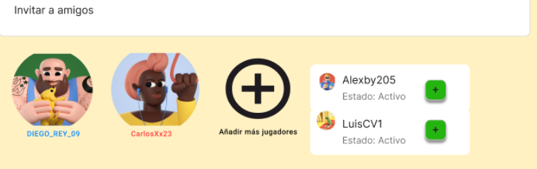|
| En este caso, la interfaz de usuario facilita la invitación de amigos a una partida en el componente de creación de partida. En este componente podemos ver una sección para invitar amigos donde se muestran algunos perfiles de los amigos del jugador y un botón (“Añadir más jugadores”) que activará un desplegable donde se listan más amigos del jugador para poder seleccionarlos y añadirlos a la partida. 

### HU-41 (ISSUE#87): 📧SOLICITUD DE UNIÓN A OTRA PARTIDA DE AMIGO: ([Enlace ISSUE](https://github.com/gii-is-DP1/dp1-2025-2026-l4-4-25/issues/87))
| "Como jugador, quiero que el sistema, a través de la sección de amigos, permita pulsar sobre un amigo específico para poder enviar una solicitud de unión a una partida creada en curso de dicho amigo seleccionado." 
|----| 
| 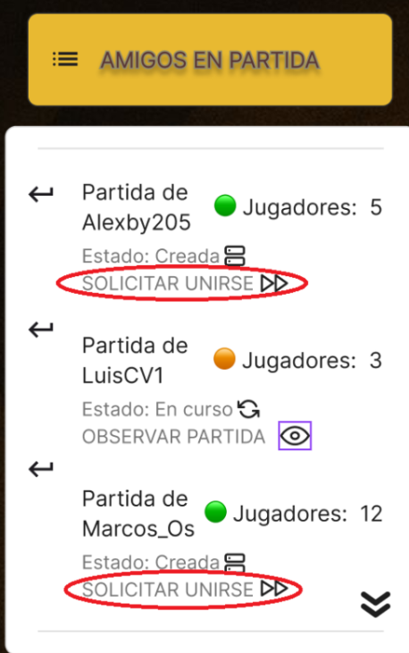|
| La interfaz de usuario muestra dentro de la sección “Amigos en partida” las partidas que están jugando cada uno de nuestros amigos conectados. Nos permitirá saber si las partidas ya están empezadas (“En curso”) o si aún podemos solicitar la unión (“Solicitar unirse”). Este último caso es el que nos interesa para esta historia de usuario, pues observamos que existe un botón (“SOLICITAR UNIRSE”) que, al ser pulsado, se enviará una solicitud al jugador correspondiente.|

### HU-42 (ISSUE#88): 👀SOLICITUD DE ESPECTADOR DE PARTIDA: ([Enlace ISSUE](https://github.com/gii-is-DP1/dp1-2025-2026-l4-4-25/issues/88))
| "Como jugador, quiero que el sistema tenga un chat entre los jugadores de la partida durante la misma para poder comentar en él con los demás jugadores suposiciones sobre quién puede/n ser el/los saboteador/es, jugadas colaborativas, etc."
|----| 
|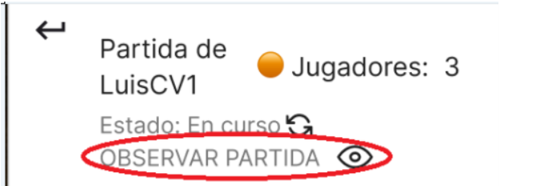|
| De nuevo, la interfaz de usuario mediante la sección “Amigos en Partida” nos permite ser espectadores de la partida al pulsar sobre el botón “SER ESPECTADOR PARTIDA”. |

### HU-43 (ISSUE#89): 👁MODO ESPECTADOR PARA AMIGOS: ([Enlace ISSUE](https://github.com/gii-is-DP1/dp1-2025-2026-l4-4-25/issues/89))
| "Como jugador, quiero que el sistema tenga un modo espectador para ver las partidas de otros jugadores sin jugar, siempre y cuando sea amigo de todos los jugadores de la partida. "
|----| 
|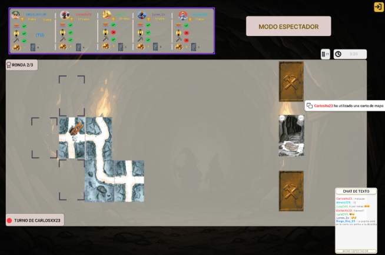|
|En este caso, la interfaz de usuario permitirá al espectador observar la partida, pero con diferencias notables respecto a los jugadores que participan en ella: La interfaz no hará visible para el espectador los mazos del resto de jugadores, hará que pueda observar el chat pero no escribir en él y, obviamente, no le permitirá interactuar de ninguna forma en la partida (solo visionarla).|

### HU-44 (ISSUE#90): 🔊CHAT ENTRE LOS JUGADORES EN LA PARTIDA: ([Enlace ISSUE](https://github.com/gii-is-DP1/dp1-2025-2026-l4-4-25/issues/90))
| "Como jugador, quiero que el sistema tenga un chat entre los jugadores de la partida durante la misma para poder comentar en él con los demás jugadores suposiciones sobre quién puede/n ser el/los saboteador/es, jugadas colaborativas, etc." 
|----| 
|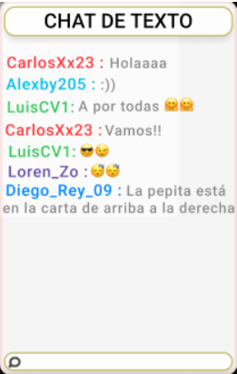|
| En la interfaz de la partida, en la esquina inferior derecha, aparece un recuadro llamado “CHAT DE TEXTO” con el log de mensajes de la partida y un input de texto abajo. Para enviar el mensaje basta con introducirlo en el input de texto y posteriormente pulsar el botón derecho para enviarlo.|

---
---

## 4️⃣ Diagrama conceptual del sistema

> [ACCEDA AL ENLACE DE NUESTRO DIAGRAMA EN DRAW.IO PARA UNA MEJOR VISIÓN INTERACTIVA](https://drive.google.com/file/d/1iKzdVrxEugiz7iYnUBxZkghGzazHpXUN/view?usp=sharing)

>💡 Para acceder correctamente al enlace es necesario estar registrado en Draw.io. Este enlace llevará a una pantalla de Google Drive en la que habrá que seleccionar la opción "Abrir con - Draw.io"

## 5️⃣ Reglas de Negocio
_Hemos decidido **dividir** las Reglas de Negocio por varios bloques para facilitar su comprensión, ya que la mayoría de estas reglas tienen que ver a las reglas del juego de mesa real, pero es importante tener en cuenta las reglas de negocio enfocadas a la aplicación en sí. Los bloques tendrán la nomenclatura "BX" siendo "X" el número del bloque_

### B1: Inicio de Partida y Configuración

### R1 – Número mínimo y máximo de jugadores
Una partida solo puede comenzar si participan entre 3 y 12 jugadores.

Por ejemplo: no se podrá iniciar una partida con solo 2 jugadores ni con más de 12.

### R2 – Inicio de una partida con menos jugadores de los indicados en la configuración de la partida
Una partida puede comenzar aunque hayan menos jugadores que lo establecido en la configuración, teniendo en cuenta la R1 sobre que no se puede iniciar una partida con solo 2 jugadores. 

Por ejemplo: Si Carlos ha configurado una partida para 8 jugadores pero solo se han unido 6, Carlos puede empezar la partida y se jugará con 7 jugadores (los 6 que ha invitado más él mismo).
### R3 – Asociación de saboteadores según número de jugadores
El sistema debe asignar automáticamente cuántos saboteadores y cuántos buscadores habrá en la partida en función del número total de jugadores (en partida, no configutados, como se ha descrito en la R2), siguiendo las reglas oficiales del juego.

Distribución oficial de roles:

* 3–5 jugadores → 1 saboteador
* 6–7 jugadores → 2 saboteadores
* 8–9 jugadores → 3 saboteadores
* 10-12 jugadores → 4 saboteadores

El resto de jugadores siempre serán buscadores de oro.

Por ejemplo: si hay 5 jugadores en la partida, el sistema asignará 1 saboteador y 4 buscadores. Si hay 8 jugadores, el sistema asignará 3 saboteadores y 5 buscadores.

### R4 – Asignación inicial de roles de manera oculta
La aplicación asigna ocultamente el rol (buscador de oro o saboteador) a cada jugador al inicio de la ronda.

Por ejemplo: si hay 8 jugadores, se asignarán 3 saboteadores y 5 buscadores sin que los demás lo sepan.

### R5 – Reparto inicial de cartas
Cada jugador debe recibir un número de cartas (túnel y acción) según el recuento de jugadores, y el resto formará la pila de robo.

Por ejemplo: con 8 jugadores, cada uno recibe 4 cartas al inicio de la ronda, y las cartas restantes forman la pila de robo.

### B2: Turnos y Acciones de Juego

### R6 – Respeto de turnos
Cuando un jugador no se encuentre en su turno de juego, no podrá usar ninguna de sus cartas.

Por ejemplo: En una partida participan 4 jugadores: Marcos, Luis, Alejandro y Carlos. Si es el turno de Carlos; ni Marcos, ni Luis, ni Alejandro podrán realizar ningún movimiento.

### R7 – Orden de turnos
El turno inicia en el jugador más joven y luego continúa siguiendo el orden de la edad.

Por ejemplo: Si los jugadores A, B, C y D participan y A es el más joven, A jugará primero, luego B (que tiene más edad que A), luego C (que tiene más edad que B), luego D (que tiene más edad que C), y luego de nuevo A.

### R8 – El jugador siempre tiene que jugar su ronda
En el turno de un jugador, sí o sí, al menos que se quede sin cartas en su mazo, tiene que tomar una decisión entre estas: poner una carta de túnel, jugar una carta de acción o descartar.

### R9 – Robo de cartas obligatorio
En cada turno, el jugador debe primero jugar una carta (o pasar descartando) y luego robar una nueva del montón de robo, si quedan cartas.

Por ejemplo: Durante el turno de Marcos, él elige colocar una carta de acción frente a otro jugador, y luego recibe una carta de la pila.

### R10 – No robar si no hay cartas
Si ya no quedan cartas en la pila de robo, los jugadores no robarán al final de su turno.

Por ejemplo: Si en la ronda ya no quedan cartas en la pila, Marcos no podrá robar y solo puede jugar con las cartas que ya tiene.

### R11 – Descarte opcional
Si un jugador no puede o no quiere jugar, debe descartar una carta y pasar. 

Por ejemplo: Si Luis no tiene carta de túnel válida ni acción útil para jugar, escoge una carta de su mano y la descarta, y termina su turno.

### R12 – Visibilidad oculta de descartes
Las cartas descartadas no son visibles para otros jugadores.

Por ejemplo: En una partida de 5 jugadores, si Marcos descarta una carta de su mano, ningún otro jugador de los 4 restantes podrá ver qué función tenía dicha carta descartada.

### B3: Colocación y Uso de Cartas

### R13 – Colocación válida de túneles
Una carta de túnel sólo puede colocarse si conecta correctamente con las cartas ya existentes en el tablero adyacentes a la celda en la que se quiere poner la nueva carta de túnel (encajan sus caminos) y no puede colocarse en orientación incorrecta(que no conecten los caminos).

Por ejemplo: Si en el tablero hay una carta túnel con una salida hacia la derecha, el jugador sólo puede colocar otra carta que tenga salida compatible hacia la izquierda, no una que no conecte.

### R14 – Uso adecuado de carta de derrumbe
La carta de derrumbe elimina exclusivamente cartas de tipo túnel en el tablero, no puede eliminar las de inicio y destino. Cuando se elimina la carta, se envía al montón de descartes.

Por ejemplo: Luis juega derrumbe frente a sí mismo y elige una carta del túnel en el tablero (que no sea inicio o destino), la retira al montón de descartes.

### R15 – No mover cartas en tablero
Un jugador no podrá mover ninguna carta que ya haya sido puesta en el tablero, excepto si se usa un carta de derrumbe como se menciona en el R14.

Por ejemplo: En una partida donde participan 4 jugadores: Marcos, Luis, Alejandro y Carlos. Ningún jugador podrá cambiar la posición de una carta túnel colocada previamente en el tablero ni manipularla de ninguna forma (como girarla), excepto si se usa una carta de derrumbe.

### R16 – Uso de cartas de destrucción
Una carta de destrucción de herramienta solo puede usarse si el objetivo tiene esa herramienta funcional.

Por ejemplo: Si Marcos quiere lanzar una carta de destrucción de herramienta (por ejemplo de destrucción de vagoneta) a Carlos para que no pueda seguir construyendo túnel, Carlos debe tener su herramienta de “vagoneta” funcionando para que este movimiento sea legal.

### R17 – Uso de cartas de reparación
Una carta de reparación solo puede usarse si el objetivo tiene la herramienta rota correspondiente.

Por ejemplo: si frente a Carlos hay una carta de “vagoneta rota”, él podrá jugar una carta “vagoneta reparada” para reparar; no podrá jugar si no hay ninguna herramienta rota frente a él.

### R18 – Uso de cartas de reparación dobles
Una carta de reparación doble puede jugarse para reparar únicamente una de las dos herramientas (independientes) que aparecen en la carta para reparar, es decir, es una carta que solo se usa una vez y para reparar exclusivamente una de las dos herramientas indicadas.

Por ejemplo: Si Marcos tiene en su mano una carta de reparación doble para las herramientas “pico” y “vagoneta” y tiene rotas sus herramientas “pico” y “vagoneta”, solo podrá reparar con su carta de reparación doble o el “pico” o la “vagoneta”.

### R19 – Uso adecuado de carta de mapa
La carta de mapa permite al jugador que la ha usado mirar una de las cartas de destino del tablero exclusivamente (entre las tres posibles), revelarla sólo para él y volverla a colocar boca abajo. Por último, debe descartar la carta de acción de mapa. No podrá bajo ninguna circunstancia ser usada sobre otro tipo de carta.

Por ejemplo: Alejandro utiliza una carta de mapa para ver la carta destino número 2, descubre que es piedra, vuelve a colocarla boca abajo, y descarta la carta de mapa utilizada.

### B4: Finalización de Rondas y Juego

### R20 – Fin de ronda
Una ronda termina si se logra conectar un túnel ininterrumpido desde la carta de inicio hasta la carta destino que contiene el oro, o si todos los jugadores se quedan sin cartas.

Por ejemplo: en la partida, Marcos logra conectar el túnel hasta el tesoro, inmediatamente termina la ronda. O bien si se agotan las cartas de todos los jugadores, también finaliza.

### R21 – Ganadores de la ronda
Cuando la ronda finaliza por algún motivo comentado en la R20, los ganadores son los siguientes:
* Si han conseguido llegar al oro, ganan los mineros. 
* Si por el contrario ya no quedan más cartas ni en el montón de robo ni en los mazos y no se ha llegado al oro, ganan los saboteadores. 

### R22 – Revelación de roles al final de ronda
Al finalizar una ronda, se revelan los roles de todos los jugadores (quién era saboteador y quién minero) antes de repartir las pepitas.

Por ejemplo: al terminar la ronda, se muestran las cartas de enano para que todos vean quiénes eran saboteadores.

### R23 – Reparto de pepitas si ganan mineros
Si los mineros (buscadores) ganan, cada uno recibirá un número, entre 1 y 3, de pepitas de oro. 
Se cogen tantas cartas de pepita (del montón de pepitas ordenado aleatoriamente) como jugadores haya **INCLUYENDO SABOTEADORES**. El primero que llegó al oro elige una de esas cartas al azar. Los demás jugadores reciben en el orden de la partida y en el orden del montón las demás cartas de pepita (excluyendo a los saboteadores).

Por ejemplo: si participan 5 jugadores y ganan los mineros, se toman 5 cartas de pepita; Lorenzo (quien alcanzó el oro) elige una al azar, luego se reparte las demás 4 cartas de pepitas siguiendo el orden del taco y de jugadores (excluyendo a los saboteadores).

### R24 – Reparto de pepitas si ganan saboteadores
Si los saboteadores ganan, pueden ocurrir las siguientes casuísticas:
* Si hay un solo saboteador, recibe 4 pepitas.
* Si hay 2 o 3 saboteadores, cada uno recibe 3 pepitas.
* Si hay 4 saboteadores, cada uno recibe 2 pepitas.

Por ejemplo: si en una partida de 3 saboteadores el equipo saboteador gana, cada uno recibe 3 pepitas.

### R25 – Conservación de pepitas
Las pepitas acumuladas se mantienen entre rondas.

Por ejemplo: si en la ronda 1 Luis obtuvo 2 pepitas y en la ronda 2 obtuvo 1, al final tiene 3 en total (no se pierden).

### R26 – Inicio de nueva ronda
Cada nueva ronda implica barajar, repartir cartas y asignar de nuevo los roles.

Por ejemplo: tras cerrar la ronda 2, se barajan de nuevo las cartas y se inicia la ronda 3 desde cero (manteniendo las pepitas acumuladas), repartiendo las cartas correspondientes y asignando a cada jugador su rol al azar.

### R27 – Orden del primer jugador en nueva ronda
El primer jugador de la nueva ronda será el segundo jugador más joven (el que tenga menos diferencia de edad con el primer jugador de la primera ronda).

Por ejemplo: Si en la ronda 1 Carlos empezó a jugar porque era el jugador más joven, en la ronda 2, Marcos, que es el segundo jugador más joven, es el que comienza el juego.

### R28 – Final del juego
El juego termina después de completarse las 3 rondas.

Por ejemplo: cuando se concluye la 3ª ronda, se procede al conteo de pepitas finales para determinar el ganador del juego global y no se procede a ninguna otra ronda.

### R29 – Empate en pepitas
Si dos o más jugadores tienen el mismo número de pepitas al final de la partida, empatan como ganadores.

Por ejemplo: si Carlos y Diego tienen 10 pepitas cada uno al final del juego y nadie más les supera, ambos son ganadores empatados.

### B5: Reglas de Aplicación General

### R30 - Registro e inicio de sesión obligatorios
Un usuario que no esté registrado ni haya iniciado sesión no dispondrá de ninguna funcionalidad de la aplicación excepto del modal que exija el registro del usuario o el inicio de sesión.

Por ejemplo: Si Lorenzo quiere usar la aplicación sin haberse registrado previamente, la interfaz gráfica meramente le mostrará el formulario de registro, con la opción de iniciar sesión si ya tiene una cuenta previa, y no le dejará interactuar de otra forma con el sistema.

### R31 - Condiciones para unirse a una partida 
Un jugador solo podrá solicitar la unión de una partida si esta se encuentra en estado “Creada” y si el número de participantes de dicha partida no ha sido completado. En ningún caso podrá unirse a una partida con estado “En Curso” o que esté completa.

Por ejemplo: Si Carlos quiere unirse a la partida del jugador Marcos, solo podrá hacerlo si la partida que ha creado Marcos está en estado “Creada” y no en “En Curso”, y si la partida de Marcos está configurada para 8 jugadores, que hayan menos de 8 jugadores unidos.

### R32 - Privacidad una partida
Un jugador podrá unirse a una partida pública sin necesidad de invitación previa a la partida. En cambio, si la partida es privada, es obligatorio que el jugador solicite la unión a dicha partida y el creador de la misma acepte que se una. Para ambos casos, deben cumplirse la R31.

Por ejemplo: Si Marcos es un jugador que quiere unirse a la partida de Luis, si Luis creó esta partida como pública, podrá acceder a ella si se cumplen las condiciones (R31). Sin embargo, si la partida de Luis es privada, Marcos deberá solicitar la unión a dicha partida y Luis decidirá si acepta o no su unión a la misma.

### R33 - Observación de una partida en curso
Un usuario solo podrá ser espectador de una partida si dicha partida está siendo jugada en tiempo real (tiene el estado “En curso”). No se podrá ser espectador de partidas que no hayan empezado o por el contrario ya hayan finalizado.

Por ejemplo: Si Luis desea observar la partida de Carlos, dicha partida tiene que indicar “En Curso”, no podrá visualizar una partida de Carlos si está "Creada" o si ya está "Terminada"

### R34 - Jugadores de la partida amigos de espectador
Un jugador que desea ser espectador de una partida solo puede ser espectador de dicha partida si todos los jugadores que participan en ella son amigos del usuario que quiere ser espectador.

Por ejemplo: Si Marcos quiere ser espectador de la partida de Luis, donde están participando 3 personas más (Diego, Lorenzo y Carlos), Marcos debe ser amigo no solo de Luis, sino que también deberá ser amigo de Diego, Lorenzo y Carlos. Si Marcos no es amigo de ninguno de estos jugadores, no podrá ser espectador de la partida.

### R35 - Administrador en partida
Un administrador **NO** puede ser un participante en una partida, solo puede observarla y tomar registro de los jugadores.

Por ejemplo: Si Diego es administrador, no puede participar en una partida, pero si podrá acceder a los datos de esta.

### R36 - Amistades de administrador
Un administrador **NO** puede ser amigo de otro usuario.

Por ejemplo: Si Marcos es administrador, no puede ser amigo de Lorenzo, siendo Lorenzo un jugador.

### R37 - Cambios en los formularios de edición
Los formularios de edición de cualquier funcionalidad de la aplicación (inicio de sesión, registro, edición de pefil, etc) solo van a poder guardar, confirmar y actualizar los cambios en la base de datos si al menos uno de los campos editables del formulario ha sido modificado. Es decir, si no se modifica nada en ningún campo, la opción de "Guardar cambios" no estará disponible y no se ejecutará nada en el backend. 

Por ejemplo: Si Lorenzo es un jugador que decide editar su perfil, en la pantalla de "Edición de perfil" es obligatorio que cambie la información que anteriormente existía y que mostraban los campos del formulario. Si al final no decide editar nada, la opción "Guardar cambios" no estará disponible. Solo si edita un solo campo, como la fecha de nacimiento, el sistema detectará una modificación respecto al dato anterior que había en ese campo y permitirá enviar la nueva información al backend.

### R38 - Eliminar usuarios durante la partida 
Bajo ninguna circunstancia ningún usuario, administrador o jugador, podrá eliminar a otro jugador de una partida en juego. 

Por ejemplo: Si Marcos es un administrador, únicamente poseerá los privilegios de gestionar partidas de forma externa y estadística, no podrá sacar a ningún otro jugador de la partida. Si Lorenzo es un jugador, tampoco podrá expulsar a ningún otro jugador que se encuentre con él en la partida. 
