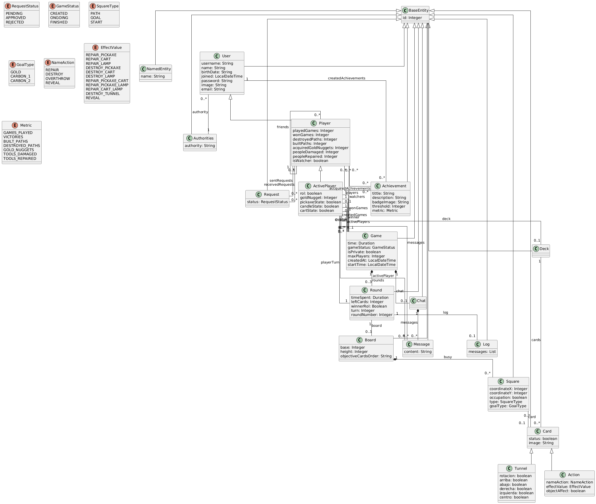
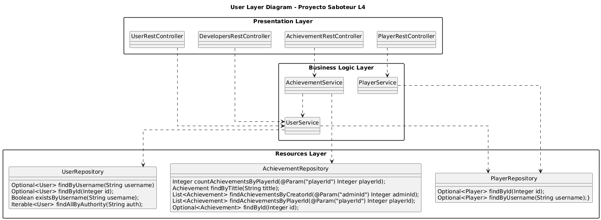
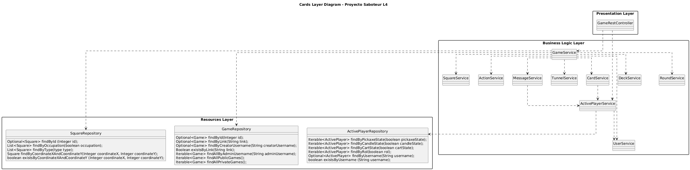
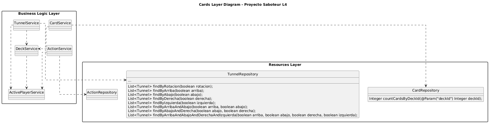
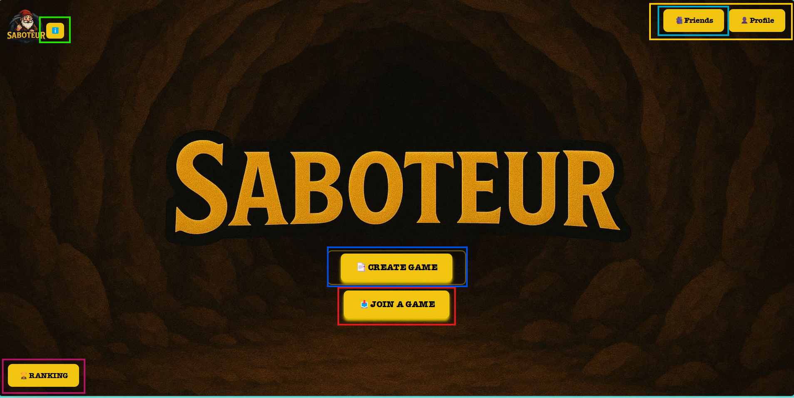
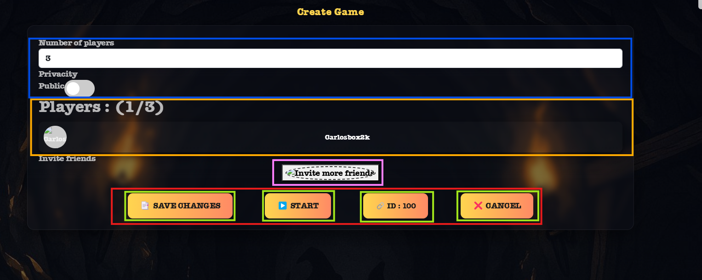
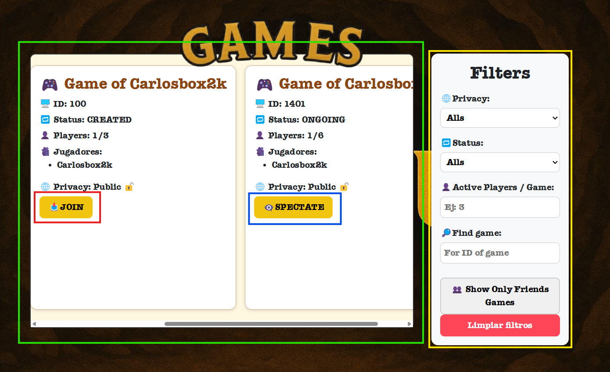

# 💻 Documento de diseño del sistema 💻
**Asignatura:** Diseño y Pruebas (Grado en Ingeniería del Software, Universidad de Sevilla)  
**Curso académico:** 2025/2026 
**Grupo/Equipo:** L4-4  
**Nombre del proyecto:** Saboteur 
**Repositorio:** (https://github.com/gii-is-DP1/dp1-2025-2026-l4-4-25/tree/main)
**Integrantes (máx. 6):** <!-- Nombre Apellidos (US-Id / correo @us.es) -->

Alejandro Caro Pérez (FQY7185 / alecarper@alum.us.es)

Lorenzo Valderrama Román (WRG8176 / lorvalrom@alum.us.es)

Diego Rey Carmona (RHQ7780 / diereycar@alum.us.es)

Marcos Ángel Ayala Blanco (GBK4935 / marayabla@alum.us.es)

Carlos Borrego Ortiz (HKP3295 / carborort@alum.us.es)

Luis Calderón Carmona (JGR9196/ luicalcar@alum.us.es)

_Esta es una plantilla que sirve como guía para realizar este entregable. Por favor, mantén las mismas secciones y los contenidos que se indican para poder hacer su revisión más ágil._ 

## 1️⃣Introducción


El valor que puede aportar nuestro Proyecto **Saboteur** es el de implementar un juego de mesa vía web / online en el que pueden jugar distintos jugadores **simultáneamente** y **gratuito**.
Los **objetivos** de dicha implementación es jugar de la misma manera que si jugáramos en persona.
Las partidas tendrán un **mínimo** de 3 jugadores hasta 12 jugadores entre los que se **repartirán** los roles definidos en las reglas de negocio.
Una vez asignados los roles y las cartas de cada uno, los **buscadores de oro** intentarán construir el camino hasta donde creen que están las **pepitas de oro** y los **saboteadores** tendrán que poner trabas para impedir que los buscadores puedan lograr su hazaña.

Las partidas suelen durar de **20 min a 30 min**. Dependiendo de lo rápido que los buscadores lleguen al oro o de que a estos se les agoten las cartas gracias a la eficacia de los saboteadores.
El vencedor será el jugador que **más** pepitas de oro haya conseguido.


Las partidas suelen durar de **20 min a 30 min**. Dependiendo de lo rápido que los buscadores lleguen al oro o de que a estos se les agoten las cartas gracias a la eficacia de los saboteadores.
El vencedor será el jugador que **más** pepitas de oro haya conseguido.


#### · VIDEO EXPLICATIVO :

<a href="https://www.youtube.com/watch?v=lwxIUdtN4aE" style="display:inline-block;padding:10px 15px;background:#008aff;color:#fff;border-radius:5px;text-decoration:none;">
 🎞 PULSE PARA VER VIDEO
</a>

## 2️⃣Diagrama(s) UML:

### Diagrama de Dominio/Diseño

En esta sección se ha proporcionado un diagrama UML de clases que describe el modelo de dominio de nuestra aplicación:




<a href="https://github.com/gii-is-DP1/dp1-2026-l4-4-25/main/docs/diagrams/DomainDiagramUML.iuml" 
   style="
     display:inline-block;
     padding:12px 20px;
     background:#0052ff;
     color:#fff;
     border-radius:6px;
     text-decoration:none;
     font-weight:600;
     box-shadow:0 2px 6px rgba(0,0,0,0.15);
     transition:background 0.3s ease;
   "
   onmouseover="this.style.background='#003dd9'"
   onmouseout="this.style.background='#0052ff'">
   ❕ Pulse para ver archivo .iuml
</a>


### Diagrama de Capas (incluyendo Controladores, Servicios y Repositorios)

         

                

<a href="https://github.com/gii-is-DP1/dp1-2026-l4-4-25/main/docs/diagrams/UserLayerUMLPackageDiagram.iuml" 
   style="
     display:inline-block;
     padding:12px 20px;
     background:#0052ff;
     color:#fff;
     border-radius:6px;
     text-decoration:none;
     font-weight:600;
     box-shadow:0 2px 6px rgba(0,0,0,0.15);
     transition:background 0.3s ease;
   "
   onmouseover="this.style.background='#003dd9'"
   onmouseout="this.style.background='#0052ff'">
   ❕ Pulse para ver archivo .iuml
</a>




<a href="https://github.com/gii-is-DP1/dp1-2026-l4-4-25/main/docs/diagrams/GameLayerUMLPackageDiagram.iuml" 
   style="
     display:inline-block;
     padding:12px 20px;
     background:#0052ff;
     color:#fff;
     border-radius:6px;
     text-decoration:none;
     font-weight:600;
     box-shadow:0 2px 6px rgba(0,0,0,0.15);
     transition:background 0.3s ease;
   "
   onmouseover="this.style.background='#003dd9'"
   onmouseout="this.style.background='#0052ff'">
   ❕ Pulse para ver archivo .iuml
</a>



<a href="https://github.com/gii-is-DP1/dp1-2026-l4-4-25/main/docs/diagrams/CardLayerUMLPackageDiagram.iuml" 
   style="
     display:inline-block;
     padding:12px 20px;
     background:#0052ff;
     color:#fff;
     border-radius:6px;
     text-decoration:none;
     font-weight:600;
     box-shadow:0 2px 6px rgba(0,0,0,0.15);
     transition:background 0.3s ease;
   "
   onmouseover="this.style.background='#003dd9'"
   onmouseout="this.style.background='#0052ff'">
   ❕ Pulse para ver archivo .iuml
</a>


**-Nota:** *Ante los fallos de importación y del propio rendimiento de PlantUML se ha decidido importarlo como PNG y adjuntar la ruta del código que ha generado dichos diagramas.*

---

## 3️⃣Descomposición del mockups del tablero de juego en componentes

## 🧩Mockup: Pantalla de Lobby




### ℹ️Descripción general
La pantalla de **Lobby** actúa como el punto de entrada principal del usuario tras iniciar sesión.  
Desde aquí, el usuario puede **crear una partida**, **unirse a una existente**, **consultar su perfil**, **cerrar sesión** o acceder al **ranking global**. Contiene navegación entre las vistas principales.

---

### · Jerarquía de componentes

- **App – Componente raíz de la aplicación**
  - **Lobby – Pantalla principal del lobby de usuario**
    - **TopRightButtons – Contenedor de botones superiores (derecha)**
      - $\color{skyblue}{\textsf{[FriendsButton] – Abre la pestaña de la Sección Social del sistema.}}$
      - $\color{orange}{\textsf{[ProfileButton] – Redirige al perfil del usuario.}}$
    - **HeroSection – Zona central con las acciones principales**
      - $\color{blue}{\textsf{[CreateGameButton] – Navega a la pantalla de creación de partida.}}$
      - $\color{red}{\textsf{[JoinGameButton] – Permite unirse a una partida ya creada o espectear una que se encuentra empezada, navegando a la pantalla de JoinGame.}}$
    - **BottomLeftSection – Zona inferior izquierda**
      -  $\color{pink}{\textsf{[RankingButton] – Accede a la clasificación global de jugadores.}}$
    - **ButtonInfo – Zona Superior izquierda**
      -  $\color{green}{\textsf{[InfoButton] – Accede a la información del juego, desarrolladores, etc..}}$

---
                
 ## 🧩Mockup: Pantalla de Crear Partida
                


### ℹ️Descripción general
Una vez creada la partida al darle al botón [CreateGameButton] del lobby, en la pantalla de creación de partida se pueden modificar distintos elementos de la partida, como: el número máximo de jugadores que puede haber en ella; la privacidad de la partida (ya sea pública o privada); los nombres de los usuarios que están unidos a esa partida; obtener el enlace con la URL de la partida para que también puedan unirse; el botón de empezar la partida [Start]; el botón de [Save Changes] para guardar la modificación de los parámetros ya realizada; y, por último, el botón de cancelar la partida [Cancel].
                
---
### Jerarquía de componentes
- **App – Componente raíz de la aplicación**
  - **CreateGame – Pantalla de configuración y espera de la partida**
    -  $\color{blue}{\textsf{Desplegable – Control para modificar el número máximo de jugadores (solo visible para el creador).}}$
    - $\color{orange}{\textsf{Players (className="active-players-section") – Lista de jugadores unidos.}}$
      - **[ExpelPlayerButton]** – Botón para expulsar jugadores *(solo visible para el creador)*.
    - $\color{purple}{\textsf{Switch de privacidad}}$ <div className="privacy-toggle"> – Switch para modificar la privacidad (pública/privada) *(solo visible para el creador)*.
    - $\color{skyblue}{\textsf{Card-footer <div className="card-footer"> – Contenedor de botones de acción.}}$
      - 👑 **Si es Creador (`isCreator = true`):**
        - $\color{red}{\textsf{[SaveChangesButton] – Guarda los cambios realizados en la configuración *(`handleSubmit`)*.}}$
        - $\color{yellow}{\textsf{[StartButton] – Inicia la partida *(`handleStart`)*.}}$
        - $\color{green}{\textsf{[CopyLinkButton] – Copia el enlace/URL de la partida *(`handleCopyLink`)*.}}$
        - $\color{skyblue}{\textsf{[CancelButton] – Cancela o elimina la partida *(`handleCancel`)*.}}$
      - 🙋‍♂️ **Si es Invitado (`isCreator = false`):**
        - **[ExitLobbyButton]** – Abandona el lobby de la partida *(`handleExitLobby`)*.
    - 🟥 **[WaitingIndicator] (`className="waiting-piece"`)** – Indicador visual de espera.
---
    
## 🧩Mockup: Pantalla de Listar Partida
    

    
### ℹ️Descripción general
    
Al pulsar el botón **[JoinGameButton]** en el lobby, se navegará a la pantalla de la Lista de Partidas de Saboteur. Cada partida está asociada a una *Card* que mostrará el nombre del creador, el ID de la partida, el número actual y máximo de jugadores, la lista de jugadores y la privacidad de la partida. La opción del botón variará según el estado y la privacidad de la partida: si es pública, el botón será **[Join]** y si es privada, será **[Request Join]**. Si la partida ya ha comenzado, la opción será 'Espectar', y si la partida está llena, se mostrará **[Game is full]**. En la parte derecha de la pantalla, hay opciones de filtrado para una mejor búsqueda de partidas según tus requisitos, permitiendo filtrar por privacidad (Pública o Privada), por el número de jugadores o buscando la partida por el nombre del creador.

---
    
### · Jerarquía de componentes
- **App – Componente raíz de la aplicación**
  - **ListGames – Pantalla para listar y filtrar partidas disponibles** (`<div className="home-page-lobby-container">`)
      - **[Botón lobby]** – Volver al lobby *(no se encuenbtra visible en la imagen pero se encuentra arriba a la derecha)*
      - $\color{green}{\textsf{Games List Card (className="listgames-card") – Listado de partidas.}}$
          - 🫂 **Players List** (`<div className="players-list">`) – Lista de jugadores.
            - **Player Item** *(`game.activePlayers`)*
          - 👑 **Game Card Footer** (`<div className="game-card-footer">`) – Botón de acción
            - **Botones de Acción** *(Según `game.gameStatus` y `game.private`)*:
              - 📩 **Si Creada y Privada:** **[Request Join Button]** (Navega a `/board/{game.id}`).
              - $\color{red}{\textsf{📥Si Creada y Pública (No Llena): [Join Button]}}$ (Navega a `/CreateGame/{game.id}`).
              - ❗ **Si Creada y Pública (Llena):** **[Game Is Full Button]**.
              - $\color{blue}{\textsf{👁️ Si No Creada: [Spectate Button]}}$ (Navega a `/board/{game.id}`).
      - $\color{orange}{\textsf{Filters Panel (div className="filters-panel") – Panel de filtros.}}$
        - 🟠 **Filter Group: Privacy** (`<div className="filter-group">`)
          - **Select** (`<select name="privacy">`) – Filtro por privacidad.
        - 🟠 **Filter Group: Status** (`<div className="filter-group">`)
          - **Select** (`<select name="status">`) – Filtro por estado.
        - 🟠 **Filter Group: Min Players** (`<div className="filter-group">`)
          - **Input** (`name="minPlayers">`) – Filtro por mínimo de jugadores.
        - 🟠 **Filter Group: Search** (`<div className="filter-group">`)
          - **Input** (`<name="search">`) – Búsqueda por ID o creador.
        - 🟠 **[Filter Friends Button]** – Botón para filtrar solo partidas de amigos **No implementado**.
        - 🟠 **[Clear Filters Button]** – Botón para limpiar todos los filtros.

***
    
## 🧩Mockup: Pantalla de Juego (Tablero)
    

    
### ℹ️Descripción general
    
Cuando se inicia una partida nos navega al **Tablero de Juego** `/board/gameId` que cada partida tendrá asociada una `ID`, dentro de este tenemos todas las funcionalidades que tiene nuestro juego de Saboteur. Al iniciarla, se asigna los roles de Saboteador y Minero según el número de jugadores, los turnos serán asignados según la fecha de nacimiento (Restricción definida, orden de persona con más edad hasta la que menos). Encontraremos un contador de turno, un componente para saber quien es el turno, para saber las cartas del mazo general, las de cada uno, para descartar cartas, ver el estado de las herramientas, etc. Además, podremos ver el log de las partidas y de las acciones que se realizan, un chat de texto para la comunicación entre jugadores, entre otras, las detallamos a continuación.

### ⚙️Funcionalidades principales
   
- Mostrar los **jugadores activos** con su información (nombre y avatar) y el estado de las herramientas.
- Visualizar el **turno actual** y el **temporizador de turno**.
- Gestionar el **mazo de cartas** y las acciones de **descartar carta**.
- Visualizar el **rol de cada usuario** (Minero o Saboteador).
- Registrar las acciones en el **Game Log** y **Private Log**.
- Proporcionar un **chat de texto** entre jugadores.
- Renderizar el **tablero** donde se desarrollará la partida.
    
### · Jerarquía de componentes
- **App – Componente raíz de la aplicación**
    - **Estados principales (useState):**
      - `activePlayers` → Jugadores activos en la partida.  
      - `playerOrder` → Orden de los turnos según la fecha de nacimiento.  
      - `currentPlayer` → Jugador con el turno actual.  
      - `cont` → Temporizador del cambio de turno.  
      - `deckCount` → Número de cartas restantes en el mazo.  
      - `playerRol` → Roles asignados (Saboteador / Minero).  
      - `gameLog`/`privateLog` → Registro global y privado de acciones.  
      - `message`/`newMessage` → Mensajes y entrada del chat.  
      - `spectatorsPlayers` → Jugadores especteando la partida. 
      - `CardPorPlayer` → Número de cartas en mano de cada jugador.  
      - `numRound` → Ronda actual del juego.  

### $\color{fuchsia}{\textsf{1. Player Cards Section}}$
**· Contenedor:** `<div className="player-cards">`  
**· Elementos:**
- Representación de las cartas (botones):
  ```jsx
  <button className="card-slot">Card 1</button>
  ```
- Se generan según el valor de `CardPorPlayer`. *Funcionalidad aún no disponible.*

---

### $\color{purple}{\textsf{2. My Role Section}}$
**· Contenedor:** `<div className="my-role">`  
**· Función:**
- Mostrar el rol del jugador actual (solo veo el mio).
- Dos posibles roles (imagenes):
  - `minerRol.png` → Si el rol es **Minero**.
  - `saboteurRol.png` → Si el rol es **Saboteador**.

---

### $\color{brown}{\textsf{3. Deck and Actions Section}}$
**· Contenedor:** `<div className="n-deck">` y `<button className="n-discard">`  
**· Función:**
- Muestra las cartas restantes en el mazo (`deckCount`).
- Permitir descartar una carta (`handleDiscard`):
  - Solo se puede usar si es el turno de dicho jugador.
  - Resta una carta al mazo y pasa el turno al siguiente jugador. Si no hay cartas para descartar, se indica en el log con un aviso.

---

### $\color{aquamarine}{\textsf{4. Timer Section}}$
**· Contenedor:** `<div className="time-card">`  
**· Función:**
- Muestra el temporizador del turno (`⏰ min:seg`).
- Se reinicia cada vez que cambia el turno (al llegar a zero se cambia el turni).

---

### $\color{skyblue}{\textsf{5. Round Section}}$
**· Contenedor:** `<div className="round-box">`  
**· Función:**
- Indica la ronda actual (`🕓 ROUND {numRound}/3`).
    *Funcionalidad aún no disponible.*

---

### $\color{red}{\textsf{ 6. Board Grid Section}}$
**· Contenedor:** `<div className="board-grid">`  
**· Función:**
- Representa la cuadrícula principal del tablero.
- Cada celda es un `<div className="board-cell">`.
- Servirá para colocar las cartas de túnel.
    *Funcionalidad aún no disponible.*

---

### $\color{orange}{\textsf{7. Turn Indicator}}$
**· Contenedor:** `<div className="turn-box">`  
**· Función:**
- Indica visualmente el jugador que tiene el turno.
- **Ejemplo:** 
  ```
  🔴 · TURNO DE Bedilia_Estrada
  ```

---

### $\color{green}{\textsf{8. Players Sidebar}}$
**· Contenedor:** `<div className="players-var">`  
**· Función:**
- Mostrar la lista de jugadores en la partida (`activePlayers`).
- Cada jugador tiene un recuadro con:
  - Avatar (`player-avatar`)
  - Nombre (`player-name`)
  - Estados de herramientas:
    - Linterna (`🔦`)
    - Vagoneta (`🪨`)
    - Pico (`⛏️`)
  - Recursos:
    - Pepitas (`🪙`)
    - Cartas en mano (`🎴`)
- Ejemplo:
  ```jsx
  <div className="player-card player1">
    
    <div className="player-name">Alexby205</div>
    <div>🔦: 🟢 | 🪨: 🟢 | ⛏️: 🟢</div>
    <div>🪙: 0 | 🎴: 5</div>
  </div>
  ```

---

### $\color{wheat}{\textsf{9. Game Log Section}}$
**· Contenedor:** `<div className="game-log">`  
**· Subcomponentes:** 
- **Cuerpo:** Lista de mensajes de acción.  
  - `gameLog` → Acciones públicas visibles por todos los jugadores.  
  - `privateLog` → Acciones privadas visibles solo por el jugador que ha realizado una determinada acción.   
- Ejemplo:
  ```jsx
  <p className="log-entry turn">🔁 Turn of <span class="player2">Javi_Osuna</span></p>
  ```

---

### $\color{gold}{\textsf{10. Chat Section}}$
**· Contenedor:** `<div className="chat-box">`

*Funcionalidad aún no disponible.*

---

## 4️⃣Patrones de diseño y arquitectónicos aplicados
En esta sección de especificar el conjunto de patrones de diseño y arquitectónicos aplicados durante el proyecto. Para especificar la aplicación de cada patrón puede usar la siguiente plantilla:

### · Patrón: Single Page Application (SPA)
*Tipo*: Arquitectónico

*Contexto de Aplicación*

El Single Page Application se aplicó en nuestro proyecto en el Frontend abarcando todos los archivos de ´frontend/src´.

*Clases o paquetes creados*

Para implementarlo, se creó el código del directorio anteriormente mencionado.

*Ventajas alcanzadas al aplicar el patrón*

El patrón constituye una gran ventaja al construir aplicaciones web, ya que este nos permite tiempos de respuesta más eficientes y mejora la experiencia de los usuarios que jueguen en nuestro juego.
    
### · Patrón: Model View Controller (MVC)
*Tipo*: Arquitectónico

*Contexto de Aplicación*

El Modelo-Vista-Controlador se ha aplicado tanto en el Frontend como en el Backend de nuestro proyecto.

*Clases o paquetes creados*

Las clases y paquetes creados son los que se encuentran dentro del directorio `/src` en el apartado del Backend de nuestro proyecto, este incluye los controladores y modelos como base de datos en memoria, respecto al Frontend, lo encontramos en `frontend/src` para la implementación de las vistas.

*Ventajas alcanzadas al aplicar el patrón*

El patrón MVC nos permite separar de manera eficiente y fácil la funcionalidad implementada dentro de la lógica de negocio, las vistas (que sería la presentación de nuestro juego) y el manejo de los eventos a traves del Controlador.

### · Patrón: Publish/Subscribe (Pub/Sub)
*Tipo*: Arquitectónico

*Contexto de Aplicación*

El patrón Publish/Subscribe se ha aplicado tanto en el Frontend como en el Backend de nuestro proyecto. Su funcionalidad reside en el uso de _Web Sockets_ para conseguir que los jugadores del juego estén constantemente en contacto con el servidor en tiempo real. Esto es útil, por ejemplo, cuando el creador de una partida pulsa el botón "Start" y consigue que automáticamente todos los jugadores que estaban esperando el comienzo naveguen a la pantalla de jugabilidad de la partida.

Los clientes se suscriben a un canal (topic) y el servidor publica mensajes, exactamente como se hace en el ejemplo anterior con SimpMessagingTemplate.convertAndSend("/topic/game/{id}").


*Clases o paquetes creados*

Respecto a la parte de _Backend_ se han creado distintas clases para implementar este patrón, entre ellas: 
- [WebSocketConfig.java](src/main/java/es/us/dp1/l4_04_24_25/saboteur/configuration/WebSocketConfig.java)
- [WebSocketGameController.java](src/main/java/es/us/dp1/l4_04_24_25/saboteur/game/WebSocketGameController.java)
- [PATCH del GameRestController.java](src/main/java/es/us/dp1/l4_04_24_25/saboteur/game/GameRestController.java#L183-L185)

Respecto a _Frontend_ la única clase implementada ha sido una modularización de un hook que consigue gestionar la lógica de los _Web Sockets_, este hook ([useWebSocket.js](frontend/src/hooks/useWebSocket.js)) ha sido importado en la clase (CreateGame.js)[frontend/src/lobbies/games/CreateGame.js#L23-L39] y en ella se ha implementado la lógica de qué hacer en caso de recibir o enviar mensajes a través del canal.

*Ventajas alcanzadas al aplicar el patrón*

El patrón Pub/Sub permite el contacto en tiempo real con el servidor en todos los navegadores que estén abiertos y en uso por los jugadores. Las pricipales ventajas encontradas son las siguientes:

### 1. 🔌 **Desacoplamiento total**
- El **creador de la partida** no necesita saber quiénes están conectados ni cuántos son.  
- Solo **publica un evento** (por ejemplo, `GameStarted`).  
- Los **jugadores suscritos** al canal reciben el mensaje automáticamente.  
Esto simplifica enormemente la lógica del servidor.

---

### 2. 📈 **Escalabilidad**
- Permite distribuir los eventos en **múltiples servidores WebSocket** (por ejemplo, usando Redis Pub/Sub).  
- Todos los jugadores reciben el evento al mismo tiempo, **aunque estén conectados a distintos nodos**.  

---

### 3. 🧠 **Código más limpio y mantenible**
- No necesitas recorrer manualmente la lista de jugadores para enviar mensajes.  
- Cada evento se trata como una **notificación semántica** (`"start"`, `"playerJoined"`, `"playerLeft"`, etc.).  
Facilita añadir nuevos tipos de eventos en el futuro sin romper lo existente.

---

### 4. 🕒 **Sincronización en tiempo real garantizada**
- Los mensajes se distribuyen casi instantáneamente a todos los suscriptores.  
- No tienes que preocuparte por retransmitir o gestionar los reenvíos.  
Mejora la experiencia de juego al garantizar respuestas en tiempo real.

---

### 5. ⚙️ **Compatibilidad con microservicios o arquitecturas distribuidas**
- Si el backend se divide en varios servicios (por ejemplo, `games-service` y `users-service`), todos pueden **publicar o suscribirse** a los mismos canales.  
- Un **broker central** (como Redis, Kafka o RabbitMQ) coordina los mensajes.  
Aísla responsabilidades y mejora la modularidad del sistema.

---

### 6. 🔁 **Manejo flexible de reconexiones y estado**
- Los jugadores pueden reconectarse y volver a suscribirse fácilmente.  
- Puedes combinar Pub/Sub con persistencia de estado para reenviar eventos clave a jugadores que se reincorporan.  
Evita inconsistencias si alguien se desconecta brevemente.

---

### · Patrón: Repository
*Tipo*: Diseño

*Contexto de Aplicación*

Este patrón se aplicó en el Backend mediante el Framework de **Spring Boot**.

*Clases o paquetes creados*

Se crearon las clases repositorio dentro de los paquetes `achievements`,`action`,`activePlayer`,`board`,`card`,`chat`,`deck`,`game`,`message`,`player`,`round`,`square`,`tunnel` y `user`.

*Ventajas alcanzadas al aplicar el patrón*

Encapsula la lógica de acceso a datos, esto hace que nos permita trabajar con las entidades dentro de la memoria.  
    
### · Patrón: Data Transfer Objets (DTO)
*Tipo*: Diseño

*Contexto de Aplicación*

Este patrón DTO se aplicó en el Backend para facilitar la transferencia de datos entre el Backend-Frontend.

*Clases o paquetes creados*
    
Se crearon las clases se encuentran en los paquetes `user` y `player` como `X.DTO.java` 

*Ventajas alcanzadas al aplicar el patrón*
Permite agrupar y transferir datos de forma eficiente entre capas, encapsulando también la lógica de serialización.    
    
### · Patrón: Hooks
*Tipo*: Diseño

*Contexto de Aplicación*

El patrón Hooks se utilizó en los componentes relacionados con el frontend, aprovechando la funcionalidad proporcionada por el framework **React.**

*Clases o paquetes creados*
    
Los hooks se encuentran en el directorio del Frontend `frontend/src/hooks`.

*Ventajas alcanzadas al aplicar el patrón*
Permite encapsular lógica con estado en componentes reutilizables y simplificar las llamadas al backend mediante una capa de abstracción sobre *fetch()*
    
### · Patrón: Paginación
*Tipo*: Diseño

*Contexto de Aplicación*

En este patrón se aplicó para obtener y mostrar la lista de usuarios, tanto en el backend (repositorio) como en el frontend (vista del administrador).

*Clases o paquetes creados*
    
No se crearon clases o paquetes nuevos. Se modificaron los archivos `UserRepository.java`, `UserRestController.java` y `UserService.java`.

*Ventajas alcanzadas al aplicar el patrón*
Permite mostrar grandes volúmenes de datos de manera organizada dividiendo el conjunto en partes navegables.
  
### · Patrón: Componentes → Contenedor  
*Tipo:* Diseño  

*Contexto de Aplicación*  

Este patrón se ha implementado en el **frontend**, específicamente en las pantallas que conforman las diferentes opciones disponibles en el juego. Su aplicación permite dividir los componentes en dos tipos principales: los **contenedores**, que gestionan la lógica de la aplicación y el estado, y los **presentacionales**, que se encargan únicamente de la representación visual de la información.  

*Clases o paquetes creados*  

El código que implementa este patrón se encuentra dentro del directorio `frontend/src`, en donde los componentes como `Board.jsx` actúan como **contenedores** al manejar la lógica del juego, el estado de los jugadores, el control del turno, el mazo, los roles y el registro de logs.  
Los componentes más simples (botones, cartas, paneles y elementos visuales) funcionan como **componentes presentacionales**, ya que se encargan únicamente de mostrar la información al usuario.  

*Ventajas alcanzadas al aplicar el patrón*  

El patrón **Componentes Contenedor/Presentacional** permite una clara separación de responsabilidades dentro del frontend. Gracias a esta división, la lógica de negocio y la presentación se mantienen independientes, lo que facilita el mantenimiento, la escalabilidad y la reutilización de los componentes visuales del juego.  

### · Patrón: State  
*Tipo:* Diseño  

*Contexto de Aplicación*  

El patrón se aplicó para gestionar los diferentes estados de la entidad **Game** en el backend. Cada estado del juego (esperando jugadores, en curso, finalizado, etc.) cuenta con su propia implementación y comportamiento, lo que permite un control más estructurado del flujo de la partida.  

*Clases o paquetes creados*  

Se creó el paquete `states` dentro de `game`, que contiene la clase abstracta de `GameState` y sus subclases `WaitingGameState` y `FinishedGameState`, además del subpaquete `PlayingGameState`, que incluye los subpaquetes `Role SelectionState`, `ResourceGameState` y `TurnStates`.  

*Ventajas alcanzadas al aplicar el patrón*  

El uso del patrón **State** permite manejar de forma flexible los distintos estados del juego y encapsular la lógica específica de cada uno, evitando condicionales complejos y facilitando la extensión y el mantenimiento del sistema.  

 ---    
    
## 5️⃣Decisiones de diseño
_En esta sección describiremos las decisiones de diseño que se han tomado a lo largo del desarrollo de la aplicación que vayan más allá de la mera aplicación de patrones de diseño o arquitectónicos._

### Decisión 1: Importación de datos reales para demostración
#### Descripción del problema:

Como grupo, tras haber hecho un primer diseño a través de los mockups, decidimos suprimir el navbar, ya que las opciones que estaban anteriormente en él las íbamos a implementar de otra manera más intuitiva y de manera que las cosas principales del juego se muestren (o mostraran) a primera vista.

Alternativas de solución evaluadas:
Alternativa 1.a: La primera alternativa que tuvimos era modificar la navbar ya hecha, de forma que únicamente nos teníamos que limitar a poner las funcionalidades que eran necesarias de implementar.

La principal ventaja era que no la teníamos que crear desde cero, únicamente modificarla a nuestra manera. No escogimos esta opción, ya que nos dimos cuenta de que íbamos a trabajar más modificando la propia navbar que ideando otra alternativa.

Alternativa 1.b: La otra alternativa era suprimir la navbar, de forma que las funcionalidades que ya había en ella se trasladaran a un uso a través de botones.

La principal ventaja era que ya teníamos mayor libertad a la hora de la implementación, estilo y diseño de los mismos. A través del tamaño de los botones y sus estilos, también enfocamos la visión del cliente (o usuario) hacia las funciones más importantes, como serían, por ejemplo: crear una partida o unirse a una partida.

Justificación de la solución adoptada

Como consideramos que los botones eran la solución que nos daba mayor libertad a la hora de enfocar nuestro proyecto, terminamos por suprimir el navbar.
    
    
    
 
    

### Decisión 2: Pantalla intermedia entre la unión de partida y el tablero
#### Descripción del problema:

Como grupo, nos dimos cuenta de que, una vez que se ha creado la partida y para el proceso de unión de los jugadores a la misma, necesitamos una pantalla intermedia para que el procedimiento sea más sencillo e intuitivo.

Alternativas de solución evaluadas:

Alternativa 1.a: La primera alternativa era que, una vez creada la partida (al darle al botón start), esta navegara directamente al tablero y que después se unieran los jugadores para empezar la partida.

Esta alternativa haría que nos ahorrásemos más componentes e implementaciones. Una desventaja era que el tablero iba a tener demasiadas funcionalidades que no eran propias solo del juego. Otra desventaja importante era que necesitábamos tocar la lógica de negocio, ya que al navegar al tablero, el estado (o status) de la partida se pondría en ongoing y, según las reglas de negocio, los jugadores no se pueden unir a partidas que estén en curso.

Alternativa 1.b: Esta alternativa para nosotros era la más viable. Consistía en que, cuando el creador le diera al botón de crear una partida, diera la oportunidad a otros jugadores de poder unirse. Los jugadores que se hayan unido estarían en una pantalla intermedia, como una sala de espera. Una vez que todos los jugadores estuvieran en la partida, el creador le daría al botón de start y, entonces, todos los jugadores estarían ya en el tablero listos para jugar.
    

Es importante destacar que el estado de la partida no se pone en ongoing hasta que no se le da al botón de start; Al darle al botón "Create Game" en el lobby, se crea una partida y su estado está en created, estado en el que sí se pueden unir los jugadores.
    
Justificación de la solución adoptada
    
Como la alternativa 1.a hacía que tuvieramos que modificar las reglas de negocio que ya estaban implementadas, decidimos escoger la alternativa 1.b que no necesitaba modificar nada, únicamente implementar una pantalla intermedia.
    

### Decisión 3: Acciones de un admin
#### Descripción del problema:
    
Como grupo, teníamos que dejar claras las acciones que puede hacer un administrador; es decir, las cosas que puede hacer o no un admin en el juego.

Alternativas de solución evaluadas:

Alternativa 1.a: La primera opción era que el admin fuera un jugador más en el juego: que pudiera jugar a las partidas, unirse y crearlas, aparte de crear nuevos usuarios, eliminarlos y editarlos. Por lo que consideramos que el admin iba a tener muchas funcionalidades, que este iba a estar sobrecargado y no se iba a centrar en los CRUD de logros y usuarios. Rompía también la regla de negocio, ya que sería admin y player a la vez.

Alternativa 1.b: La otra opción era que el admin no pudiera jugar, es decir, que no podía ser player a la vez que admin, porque un admin no puede tener ni logros ni estadísticas. Únicamente el admin puede hacer el CRUD de los logros y los usuarios. Las otras funcionalidades las puede hacer otro jugador sin problema, por ejemplo: crear partidas, unirse a ellas, jugar, ver sus logros y estadísticas, entre otras más.

Justificación de la solución adoptada:

La alternativa 1.b fue la opción que escogimos, ya que en la 1.a el admin iba a estar muy sobrecargado de funcionalidades y nos iba a dar problemas luego en la implementación. Por lo que decidimos dividir la carga entre admin y player.
    
    
    
### Decisión 4: Opciones de roles de jugadores
#### Descripción del problema:

En el juego, cada usuario tiene un rol diferente, entonces tuvimos que ver de qué manera se asignaba ese rol al registrarse un usuario.

Alternativas de solución evaluadas:

Alternativa 1.a: La primera opción era que en la pantalla de registro (register) hubiera en el formulario la opción de registrarse como jugador (player) o administrador (admin). La desventaja era que cualquier usuario podía ser admin libremente.

Alternativa 1.b: La otra alternativa era que, al registrarse, el usuario fuera siempre un jugador. Entonces, la única forma de ser admin sería que otro admin creara un usuario con el rol de admin. La desventaja es que siempre tiene que haber un admin inicial en el juego.

Alternativa 1.c: Otra alternativa que contemplamos fue que al registrarse un usuario fuera jugador y que otro admin le asignara el rol de admin, sin necesidad de tener que crear otro usuario. La desventaja era que, como el admin no puede jugar una partida, iba a haber mucho conflicto. Eso suponía que la lista de los activeplayers tendría que estar siempre actualizada para evitar romper esa regla de negocio.

Justificación de la solución adoptada:

La opción que finalmente escogimos fue la 1.b, porque era más lógica y no atentaba contra la seguridad del juego.
    

### Decisión 5: Privacidad de las partidas
#### Descripción del problema:

Como grupo, para las partidas teníamos que decidir la privacidad de las mismas, ya que algunos usuarios quieren jugar con más gente y otros únicamente con sus amigos.

Alternativas de solución evaluadas:

Alternativa 1.a: La primera opción era que las partidas no tuvieran privacidad, es decir, que iban a ser todas públicas y cualquier usuario se podía unir siempre y cuando hubiera (o hubiese) hueco para él. La desventaja era que cualquier usuario se podía unir a la partida, por lo tanto, no se podía jugar únicamente con las personas que querías.

Alternativa 1.b: Por lo tanto, la otra alternativa era que una partida fuera pública o privada, para que el usuario pudiera elegir con qué personas jugar. La desventaja es que teníamos que implementar dos nuevas funciones. Una de ellas es la solicitud de unión (request join) cuando la partida fuera privada; así, un jugador le pide al creador que se quiere unir a su partida y el creador decidiría si aceptar la petición o rechazarla. Y la otra era que, al crear una partida, pudieras elegir entre crear una pública o privada.

Justificación de la solución adoptada:

Finalmente, decidimos escoger la 1.b porque, a pesar de tener que implementar más funciones, la experiencia de usuario iba a mejorar bastante.
    
    
### Decisión 6: Orden de los turnos en las partidas
#### Descripción del problema:

En el juego Saboteur, una de las reglas es que el jugador más bajo de estatura empieza jugando. Por lo tanto, el orden de los turnos se decide por la estatura de los jugadores. Como grupo, tuvimos que decidir la manera de implementar este orden.

Alternativas de solución evaluadas:

Alternativa 1.a: La primera alternativa era que un atributo de un jugador fuera su estatura. La principal desventaja era que no todos los jugadores conocen su estatura exacta en todo momento. Además, la estatura es demasiado precisa como para asegurarnos de que todos los jugadores se hayan medido bien. Otra desventaja es que la altura puede variar con los años.

Alternativa 1.b: La otra alternativa era decidir el orden de los jugadores a través de la fecha de nacimiento (otro atributo del jugador) de cada uno, ya que es algo que siempre se tiene presente y los jugadores nuevos o ya existentes no necesitan saber en todo momento su altura, solo con su fecha de nacimiento valdría. La fecha de nacimiento no varía.

Justificación de la solución adoptada:

Finalmente, elegimos la opción 1.b, ya que es la opción más cómoda para el usuario (o cliente) y mejora la experiencia de usuario.


### Decisión 7: Acciones de los jugadores respecto a las partidas
#### Descripción del problema:

Como grupo, tuvimos que restringir las acciones de los jugadores en las partidas, ya que determinadas acciones podían alterar el juego de otros jugadores.

Alternativas de solución evaluadas:
Alternativa 1.a: La primera alternativa era ser flexibles y permitir que los jugadores se unieran o abandonaran una partida en cualquier momento, incluso si su estado era Ongoing.

La ventaja principal era la flexibilidad; si un jugador se desconectaba por error, otro podría entrar a reemplazarlo.
La gran desventaja era que rompía la lógica de negocio principal: los roles se asignan al inicio en función del número de jugadores. Si alguien entraba o salía a mitad de la partida, el balance de los roles se vería afectado, ya que podrían haber roles con un número incorrecto de jugadores

Alternativa 1.b: La otra alternativa era restringir estrictamente el uso de diferentes acciones basándose en el estado de la partida.
Una restricción es que los jugadores no pueden unirse a una partida ya empezada (estado: Ongoing), ya que esto significa que todos los jugadores están en el tablero jugando. La otra acción restringida es que un jugador no puede salirse de una partida cuando ya ha empezado (estado: Ongoing). Esto es así porque los roles se asignan en función del número de jugadores.

Justificación de la solución adoptada:
Finalmente, escogimos la Alternativa 1.b. Aunque la Alternativa 1.a parecía ofrecer más libertad al usuario, la descartamos porque alteraba las reglas de negocio del juego.


### Decisión 8: Log para las acciones de los jugadores
#### Descripción del problema:

Como grupo, para poder mejorar la experiencia de usuario mientras se está jugando, pensamos en alguna opción para que los jugadores sepan cuál fue la última acción del jugador o el punto de la partida en ese momento. Esto influirá después en la decisión que tomará el jugador en su turno.

Alternativas de solución evaluadas:
Alternativa 1.a: La primera alternativa era resaltar la carta o la acción de amarillo para que los demás jugadores sepan qué ha hecho ese jugador en su turno. El problema era que no se podía saber ni quién fue ni qué otras acciones se han realizado anteriormente.

Alternativa 1.b: La segunda opción era crear un log (registro) con todas las acciones que han hecho los jugadores. Ya no haría falta resaltar las cartas, sino que cada jugador podrá ver qué han hecho los otros jugadores anteriormente y así poder decidir de una manera más precisa.

Justificación de la solución adoptada:
Finalmente, escogimos la alternativa 1.b. La alternativa 1.a no era muy precia para los jugadores, ya que no permitía ver acciones pasadas ni saber qué jugador las había realizado. El log ofrece un historial completo, permitiendo a los jugadores tomar decisiones más precisas y estratégicas, lo cual mejora la experiencia de juego.


### Decisión 9: Asignación de ganadores de la partida
#### Descripción del problema:

Como grupo, decidimos que cuando ganaba un rol u otro, las pepitas de oro se repartirían entre los jugadores que componían ese rol. Por ejemplo: si los buscadores de oro ganan, se repartirán las pepitas de oro de forma aleatoria entre todos los buscadores de oro. A unos les tocaría 1 pepita y a otros 2 o 3 pepitas. Teníamos que decidir cómo hacer este reparto.

Alternativas de solución evaluadas:
Alternativa 1.a: La primera era repartir las pepitas a partes iguales entre los ganadores. El problema es que era demasiado predecible, además, no era fiel a las reglas del juego original.

Alternativa 1.b: La otra era repartir las pepitas de forma aleatoria (a uno le toca 1, a otro 2, etc.). Así replicamos el factor suerte en el juego

Justificación de la solución adoptada:
Nos quedamos con la Alternativa 1.b. Era la más lógica porque así el final de la partida es más impredecible y fiel al juego de mesa original.

### Decisión 10: Log de movimientos incorrectos
#### Descripción del problema:

Como grupo, teníamos que pensar en la manera en la cual avisaríamos a los jugadores de algunos movimientos incorrectos.

Alternativas de solución evaluadas:

Alternativa 1.a: La primera alternativa era que directamente no se le permitiera al jugador hacer ese movimiento o acción y le saltara una alerta roja diciendo que era incorrecto. Esto era demasiado simple para el usuario, pero fácil de implementar.

Alternativa 1.b: La segunda alternativa consistía en lo mismo, pero con la diferencia de que al hacer el movimiento incorrecto, a la persona se le mostrara una alerta roja con el motivo por el cual la acción o el movimiento era incorrecto. También mostraría las distintas acciones o movimientos que el jugador podría hacer con la carta seleccionada, la cual estaría resaltada de amarillo. La desventaja es que es más laborioso de implementar.

Justificación de la solución adoptada:

Nos decidimos por la opción 1.b, ya que, como otras decisiones escogidas, esta también iba a mejorar bastante la experiencia de usuario del juego, pues la opción 1.a era demasiado simple.


    

    

## 6️⃣Refactorizaciones aplicadas


### · Refactorización 1: 
En esta refactorización hemos modificado, respecto al código frontend, las pantallas de **Register, LogIn, LogOut**, que ya venia definido en el código inicial, se han modificado los estilos y la forma en la que se hace el POST en el backend.
#### Estado inicial del código
```jsx 
export default function Register() {
  let [type, setType] = useState(null);
  let [authority, setAuthority] = useState(null);
  let [clinics, setClinics] = useState([]);

  const registerFormRef = useRef();

  function handleButtonClick(event) {
    const target = event.target;
    let value = target.value;
    if (value === "Back") value = null;
    else setAuthority(value);
    setType(value);
  }

  function handleSubmit({ values }) {

    if(!registerFormRef.current.validate()) return;

    const request = values;
    request["authority"] = authority;
    let state = "";

    fetch("/api/v1/auth/signup", {
      headers: { "Content-Type": "application/json" },
      method: "POST",
      body: JSON.stringify(request),
    })
      .then(function (response) {
        if (response.status === 200) {
          const loginRequest = {
            username: request.username,
            password: request.password,
          };

          fetch("/api/v1/auth/signin", {
            headers: { "Content-Type": "application/json" },
            method: "POST",
            body: JSON.stringify(loginRequest),
          })
.then(function (response) {
              if (response.status === 200) {
                state = "200";
                return response.json();
              } else {
                state = "";
                return response.json();
              }
            })
            .then(function (data) {
              if (state !== "200") alert(data.message);
              else {
                tokenService.setUser(data);
                tokenService.updateLocalAccessToken(data.token);
                window.location.href = "/dashboard";
              }
            })
            .catch((message) => {
              alert(message);
            });
        }
      })
      .catch((message) => {
        alert(message);
      });
  }

  if (type) {
    return (
      <div className="auth-page-container">
        <h1>Register</h1>
        <div className="auth-form-container">
          <FormGenerator
            ref={registerFormRef}
            inputs={
              type === "Player" ? registerFormOwnerInputs
              : registerFormClinicOwnerInputs
            }
            onSubmit={handleSubmit}
            numberOfColumns={1}
            listenEnterKey
            buttonText="Save"
            buttonClassName="auth-button"
          />
        </div>
      </div>
    );
  } else {
    return (
      <div className="auth-page-container">
        <div className="auth-form-container">
          <h1>Register</h1>
          <h2 className="text-center text-md">
            What type of user will you be?
          </h2>
          <div className="options-row">
            <button
              className="auth-button"
              value="Owner"
              onClick={handleButtonClick}
            >
              Player
            </button>
            <button
              className="auth-button"
              value="Vet"
              onClick={handleButtonClick}
            >
Admin
            </button>
          </div>
        </div>
      </div>
    );
  }
}
// MODULE OF LOGIN: 
export default function Login() {
  const [message, setMessage] = useState(null)
  const loginFormRef = React.createRef();


  async function handleSubmit({ values }) {

    const reqBody = values;
    setMessage(null);
    await fetch("/api/v1/auth/signin", {
      headers: { "Content-Type": "application/json" },
      method: "POST",
      body: JSON.stringify(reqBody),
    })
      .then(function (response) {
        if (response.status === 200) return response.json();
        else return Promise.reject("Invalid login attempt");
      })
      .then(function (data) {
        tokenService.setUser(data);
        tokenService.updateLocalAccessToken(data.token);
        window.location.href = "/dashboard";
      })
      .catch((error) => {
        setMessage(error);
      });
  }

    return (
      <div className="auth-page-container">
        {message ? (
          <Alert color="primary">{message}</Alert>
        ) : (
          <></>
        )}

        <h1>Login</h1>

        <div className="auth-form-container">
          <FormGenerator
            ref={loginFormRef}
            inputs={loginFormInputs}
            onSubmit={handleSubmit}
            numberOfColumns={1}
            listenEnterKey
            buttonText="Login"
            buttonClassName="auth-button"
          />
        </div>
      </div>
    );
}
``` 

#### Estado del código refactorizado

```jsx
export default function Register() {
  let [authority, setAuthority] = useState(null);
  const [profileImage, setProfileImage] = useState(defaultProfileAvatar);
  const [dropdownOpen, setDropdownOpen] = useState(false); 
  const toggleDropdown = () => setDropdownOpen(prev => !prev)
  const registerFormRef = useRef();

  const handleFileChange = (event) => {
    const file = event.target.files[0];
    if(file) {
      const reader = new FileReader();
      reader.onloadend = () => {
        // reader.result tendrá la imagen como una cadena Base64
        setProfileImage(reader.result);
      };
      reader.readAsDataURL(file);
    }
  }
  function handleSubmit({ values }) {

    if(!registerFormRef.current.validate()) return;
    const request = {
      ...values,
      image: profileImage,
      authority: 2
    };

    let state = "";

    fetch("/api/v1/auth/signup", {
      headers: { "Content-Type": "application/json" },
      method: "POST",
      body: JSON.stringify(request),
    })
      .then(function (response) {
        if (response.status === 200) {
          const loginRequest = {
            username: request.username,
            password: request.password,
          };

          fetch("/api/v1/auth/signin", {
            headers: { "Content-Type": "application/json" },
            method: "POST",
            body: JSON.stringify(loginRequest),
          })

            .then(function (response) {
              if (response.status === 200) {
                state = "200";
                return response.json();
              } else {
                state = "";
                return response.json();
              }
            })
            .then(function (data) {
              if (state !== "200") alert(data.message);
              else {
                tokenService.setUser(data);
                tokenService.updateLocalAccessToken(data.token);
                window.location.href = "/lobby";
              }
            })
            .catch((message) => {
              alert(message);
            });
        }
      })
      .catch((message) => {
        alert(message);
      });

  }  
    return (
      <div className="auth-page-container">
        <Link to="/login">
            <button className="auth-returnLogin-button"> Return to Login ➡️</button>
        </Link>
        <h1>Register</h1>
        <div className="auth-form-container">
          <div style={{marginBottom: '1rem'}} className="profile-image-selector">
            <label>Select profile image:</label>
            <div className="profile-image-options">
              <Dropdown isOpen={dropdownOpen} toggle={toggleDropdown}>
                <DropdownToggle caret>
                  Choose pre-defined images
                </DropdownToggle>
                <DropdownMenu>
                  <DropdownItem onClick={() => setProfileImage(getIconImage(1))}>Miner 1</DropdownItem>
                  <DropdownItem onClick={() => setProfileImage(getIconImage(2))}>Miner 2</DropdownItem>
                  <DropdownItem onClick={() => setProfileImage(getIconImage(3))}>Miner 3</DropdownItem>
                  <DropdownItem onClick={() => setProfileImage(getIconImage(4))}>Miner 4</DropdownItem>
                  <DropdownItem onClick={() => setProfileImage(getIconImage(5))}>Miner 5</DropdownItem>
                  <DropdownItem onClick={() => setProfileImage(getIconImage(6))}>Miner 6</DropdownItem>
                </DropdownMenu>
              </Dropdown>
              <input type="file" accept="image/*" onChange={handleFileChange}/>
              {/*Previsualización */}
              
            </div>
          </div>
          <FormGenerator
            ref={registerFormRef}
            inputs={registerFormPlayer}
            onSubmit={handleSubmit}
            numberOfColumns={1}
            listenEnterKey
            buttonText="Save"
            buttonClassName="auth-button"
          />
        </div>
      </div>
    );}
    
// MODULO DE LOGIN
export default function Login() {
  const [message, setMessage] = useState(null)
  const loginFormRef = React.createRef();      
    
  async function handleSubmit({ values }) {
    const reqBody = values;
    setMessage(null);
    await fetch("/api/v1/auth/signin", {
      headers: { "Content-Type": "application/json" },
      method: "POST",
      body: JSON.stringify(reqBody),
    })
      .then(function (response) {
        if (response.status === 200) return response.json();
        else return Promise.reject("Invalid login attempt");
      })
      .then(function (data) {
        tokenService.setUser(data);
        tokenService.updateLocalAccessToken(data.token);
        window.location.href = "/lobby";
      })
      .catch((error) => {         
        setMessage(error);
      });            
  }
    return (
      <div className="auth-page-container">
        {message ? (
          <Alert color="primary">{message}</Alert>
        ) : (
          <></>
        )}
        <h1>Login</h1>
        <div className="auth-form-container">
          <FormGenerator
            ref={loginFormRef}
            inputs={loginFormInputs}
            onSubmit={handleSubmit}
            numberOfColumns={1}
            listenEnterKey
            buttonText="Log in"
            buttonClassName="auth-button"
          />
         </div>
          <div className="register-redirect">
            <p>Not registered yet? {" "}
               <Link to="/register" className="register-link">
                Sign up here
              </Link>
            </p>
         </div>
        </div>
    );  
}
    
```
#### Problema que nos hizo realizar la refactorización
- Ausencia de valores y campos respecto al modelo que se presentó para nuestro sistema.
#### Ventajas que presenta la nueva versión del código respecto de la versión original
- Ahora podemos añadir a un jugador con cierta información más (avatar, fecha de nacimiento, etc) y se ha optimizado el POST del backend.
    
### · Refactorización 2: 
En esta refactorización se ha modificado la pantalla **Lobby** en su totalidad respecto a la por defecto que traia nuestra código.
```jsx 
import React from 'react';
import '../App.css';
import '../static/css/home/home.css'; 
import logo from '../static/images/Foto_logo.jpg';

export default function Home(){
    return(
        <div className="home-page-container">
            <div className="hero-div">
                <h1>Your game</h1>
                <h3>---</h3>
                <h3>Do you want to play?</h3>
            </div>
        </div>
    );
}
``` 

#### Estado del código refactorizado

```JSX
export default function Lobby(){
    const [isAdmin, setisAdmin] = useState(false);
    const [showFriends, setShowFriends] = useState(false);
    const [isPrivate, setisPrivate] = useState(false);
    const [player, setPlayer] = useState()
    const [link,setlink] = useState("")
    const [chat,setchat] = useState()
    const jwt = tokenService.getLocalAccessToken();
    const navigate = useNavigate();

    useEffect(() => {
    const fetchPlayer = async () => {
          try {
            const loggedInUser = tokenService.getUser();
          if (!loggedInUser || !loggedInUser.id) {
            console.error("No se encontró el ID del usuario.");
            return;
        }
            const response = await fetch(`/api/v1/players/${loggedInUser.id}`, {
              method: "GET",
              headers: {
                "Content-Type": "application/json",
                "Authorization": `Bearer ${jwt}`
              }
            });
            console.log("response del player", response);
            if (response.ok) {
              const data = await response.json();
              console.log("respone 2",data)
              setPlayer(data);
            } else {
              console.error('Respuesta no OK:', response.status);
              alert('Error al obtener la información del jugador.');
            }
          } catch (error) {
            console.error('Hubo un problema con la petición fetch:', error);
            alert('Error de red. No se pudo conectar con el servidor.');
            }
        };

        let admin = false;
        try {
            const p = JSON.parse(atob(jwt.split('.')[1]));
            admin = p.authorities?.includes("ADMIN") || false;
            setisAdmin(admin);
        } catch (error) {
            console.error(error);
            return; 
        }

        // Solo buscar los datos del jugador si el usuario NO es un admin
        if (!admin) {
            fetchPlayer();
            console.log("entro")
            console.log("este es  el player", player)
        }
  },[jwt])

    async function handleSubmit() {
         console.log("este es  el player submit", player)
        const jwt = tokenService.getLocalAccessToken();
        try {
        const randomPart = generateRandomLink(16);
        const fullLink = `https://saboteur.com/game/${randomPart}`;
        setlink(fullLink)

        const gameRequest = {
            gameStatus: "CREATED",
            link: fullLink, 
            maxPlayers: 3,
            creator: player.username,
            private: false,
            activePlayers:[player.username]
        };

        console.log('Enviando solicitud de partida:', gameRequest);

        const gameResponse = await fetch("/api/v1/games", {
            method: "POST",
            headers: { 
                "Content-Type": "application/json",
                "Authorization": `Bearer ${jwt}` 
            },
            body: JSON.stringify(gameRequest),
        });

        if (gameResponse.ok) {
            const newGame = await gameResponse.json();
            alert("¡Partida creada con éxito!");
            console.log("Partida creada:", newGame);
            navigate('/CreateGame/' + newGame.id , { state: { game: newGame } });
        } else {
            const errorData = await gameResponse.json();
            alert(`Error al crear la partida: ${errorData.message}`);
        }

    } catch (error) {
        console.error('Hubo un problema con la petición fetch:', error);
        alert('Error de red. No se pudo conectar con el servidor.');
    }
}

    return(
        <div className="home-page-lobby-container">

            <div style={{ position: 'absolute', top: 0, left: 0, display: 'flex', alignItems: 'center', gap: '10px', padding: '10px', zIndex: 10 }}>
                
             </div>
            <div className="top-right-lobby-buttons">
                {/*<Link to="/register">
                    <button className="button-register">📃Register</button>
                </Link>
                <Link to="/login">
                    <button className="button-login">💻Login</button>
                </Link>
                */}
                {!isAdmin && (
                <div className="friends-dropdown-container">
                    <button 
                        className="button-logOut" 
                        onClick={() => setShowFriends(prev => !prev)}>
                        🫂Friends
                    </button>
                    {showFriends && (
                        <div className="friends-dropdown">
                            <h4>🫂Friends Section🫂</h4>
                            {friends.map((f, idx) => (
                                <div key={idx} className="friend-item">
                                    <span>{f.username}</span>
                                    <span className="friend-status" style={{ backgroundColor: f.color }}></span>
                                    <span>{f.status}</span>
                                </div>
                            ))}
                            <hr />
                            <button className="friend-action">📩Friend Request</button>
                            <button className="friend-action">🔎Find Player</button>
                        </div>
                    )}
                </div>
                )}
                <Link to="/profile">
                    <button className="button-logOut"> 👤Profile</button>
                </Link>
            </div>
            <div className="button-info">
                <Link to="/info">
                    <button className="button-info"> ℹ️</button>
                </Link>
            </div>
            {!isAdmin && (
            <div className="hero-div-lobby">
                    <button className="button-crear" onClick={handleSubmit}>📑CREATE GAME</button>
                 <Link to="/ListGames">
                <button className="button-unirse">📥JOIN A GAME</button>   
                </Link>
            </div>
             )}
            {isAdmin && (
                 <div className="hero-div-lobby">
                <Link to="/users">
                    <button className="button-users">📑Users</button>
                </Link>
                    </div>
                )}
             {isAdmin && (
                 <div className="hero-div-lobby">
                <Link to="/EditAchievement">
                    <button className="button-edit">✏️Edit Achievement</button>
                </Link>
                    </div>
                )}
            <div className="bottom-left-button">
                <Link to="/Ranking">
                <button className="button-ranking">🏆RANKING</button>
                </Link>
             </div>
        </div>
    )
}

```
#### Problema que nos hizo realizar la refactorización
- Ausencia de muchas funcionalidades y uso inutil de muchas de ellas.
#### Ventajas que presenta la nueva versión del código respecto de la versión original
- Mejora de la interfaz de la pantalla Lobby, incluyendo botones y funcionalidades fundamentales para el buen funcionamiento de nuestro sistema.
    
### · Refactorización 3: 
En esta refactorización, en **App.js** para el enrutado se han añadido y modificado las rutas que venian por defecto, nos ha servido para implementar las nuevas pantallas.
```jsx
function App() {
  const jwt = tokenService.getLocalAccessToken();
  let roles = []
  if (jwt) {
    roles = getRolesFromJWT(jwt);
  }

  function getRolesFromJWT(jwt) {
    return jwt_decode(jwt).authorities;
  }

  let adminRoutes = <></>;
  let ownerRoutes = <></>;
  let userRoutes = <></>;
  let vetRoutes = <></>;
  let publicRoutes = <></>;

  roles.forEach((role) => {
    if (role === "ADMIN") {
      adminRoutes = (
        <>
          <Route path="/users" exact={true} element={<PrivateRoute><UserListAdmin /></PrivateRoute>} />
          <Route path="/users/:username" exact={true} element={<PrivateRoute><UserEditAdmin /></PrivateRoute>} />
        </>)
    }
    if (role === "PLAYER") {
      ownerRoutes = (
        <>

        </>)
    }
  })
if (!jwt) {
    publicRoutes = (
      <>
        <Route path="/register" element={<Register />} />
        <Route path="/login" element={<Login />} />
      </>
    )
  } else {
    userRoutes = (
      <>
        {/* <Route path="/dashboard" element={<PrivateRoute><Dashboard /></PrivateRoute>} /> */}
        <Route path="/logout" element={<Logout />} />
        <Route path="/login" element={<Login />} />
      </>
    )
  }

  return (
    <div>
      <ErrorBoundary FallbackComponent={ErrorFallback} >
        <AppNavbar />
        <Routes>
          <Route path="/" exact={true} element={<Home />} />
          <Route path="/plans" element={<PlanList />} />
          <Route path="/docs" element={<SwaggerDocs />} />
          {publicRoutes}
          {userRoutes}
          {adminRoutes}
          {ownerRoutes}
          {vetRoutes}
        </Routes>
      </ErrorBoundary>
    </div>
  );
}

export default App;
``` 

#### Estado del código refactorizado

```jsx
function App() {
  const jwt = tokenService.getLocalAccessToken();
  let roles = []
  if (jwt) {
    roles = getRolesFromJWT(jwt);
  }

  function getRolesFromJWT(jwt) {
    return jwt_decode(jwt).authorities;
  }

  let adminRoutes = <></>;
  let ownerRoutes = <></>;
  let userRoutes = <></>;
  let vetRoutes = <></>;
  let publicRoutes = <></>;

  roles.forEach((role) => {
    if (role === "ADMIN") {
      adminRoutes = (
        <>
          <Route path="/users" exact={true} element={<PrivateRoute><UserListAdmin /></PrivateRoute>} />
          <Route path="/users/:id" exact={true} element={<PrivateRoute><UserEditAdmin /></PrivateRoute>} />    
          <Route path="/profile" element={<Profile />} />
          <Route path="/info" element={<Info />} />
          <Route path="/profile/editProfile" element={<EditProfile />} />  
          <Route path="/EditAchievement" element={<EditAchievements />} />
        </>)
    }
    if (role === "PLAYER") {
      ownerRoutes = (
        <>
          {/*<Route path="/register" element={<Register />} />*/}
          <Route path="/info" element={<Info />} />
          <Route path="/profile" element={<Profile />} />
          <Route path="/profile/editProfile" element={<EditProfile />} />
          <Route path="/GamesPlayed" element={<GamesPlayed />} />
          <Route path="/Achievement" element={<Achievements />} />

        </>)
    }    
  })
  if (!jwt) {
    publicRoutes = (
      <>        
        <Route path="/register" element={<Register />} />
        <Route path="/login" element={<Login />} />
      </>
    )
  } else {
    userRoutes = (
      <>
        {/* <Route path="/dashboard" element={<PrivateRoute><Dashboard /></PrivateRoute>} /> */}  
        <Route path="/lobby" element={<PrivateRoute><Lobby /></PrivateRoute>} />
        <Route path="/logout" element={<Logout />} />
        <Route path="/login" element={<Login />} />
        <Route path="/CreateGame/:id" element={<PrivateRoute><CreateGame /></PrivateRoute>} />
        <Route path="/CreateGame" element={<PrivateRoute><CreateGame /></PrivateRoute>} />
        <Route path="/board/:id" element={<PrivateRoute><Board/></PrivateRoute>} />
        <Route path="/ListGames" element={<PrivateRoute><ListGames /></PrivateRoute>} />
      </>
    )
  }

  return (
    <div>
      <ErrorBoundary FallbackComponent={ErrorFallback} >
        <AppNavbar />
        <Routes>
          <Route path="/" exact={true} element={<Home />} />
          {publicRoutes}
          {userRoutes}
          {adminRoutes}
          {ownerRoutes}
          {vetRoutes}
        </Routes>
      </ErrorBoundary>
    </div>
  );
}

```
#### Problema que nos hizo realizar la refactorización
- Rutas mal enrutadas y ausencia de muchas rutas que son importantes en nuestra aplicación.
#### Ventajas que presenta la nueva versión del código respecto de la versión original
- Ahora podemos navegar entre pantallas de manera fluida e incluyendo todas las pantallas descritas en el documento D1.
    
### · Refactorización 4: 
En esta refactorización se ha añadido Hojas de estilo **CSS** que venian dadas y han sido modificadas según el estilo de nuestra aplicación.
#### Estado inicial del código
```css 
.home-page-container{
    position: absolute;
    top: 0;
    left: 0;
    right: 0;
    bottom: 0;
    z-index: -1;
    background-image: linear-gradient(rgba(0, 0, 0, 0.2), rgba(0, 0, 0, 0.2)), url('../../images/home_background.jpg');
    background-size: cover;
    display: flex;
    justify-content: center;
    align-items: center;
}

.hero-div{
    background-color: rgba(255, 255, 255, 0.3);
    padding: 2rem;
    border-radius: 25px;
    backdrop-filter: blur(10px);
    display: flex;
    flex-direction: column;
    justify-content: center;
    align-items: center;
}

.hero-div h1{
    font-size: 3rem;
    font-weight: 700;
    color: #2f324f;
    text-align: center;
    text-transform: uppercase;
}

.hero-div h3{
    text-align: center;
}
``` 

#### Estado del código refactorizado

```CSS
.home-page-lobby-container {
  position: relative;
  width: 100%;
  height: 100vh;
  background-image: 
    url('../../images/home_background.jpg');
  background-size: cover;
  background-position: center 60%;
  display: flex;
  justify-content: center;
  align-items: center;
}

.hero-div-lobby {
  padding: 3rem;
  border-radius: 25px;
  display: flex;
  flex-direction: column;
  justify-content: center;
  align-items: center;
  gap: 20px;
  padding-top: 50vh;
}

.hero-div-lobby button {
  white-space: nowrap;
  padding: 1rem 2rem;
  font-size: 1.2rem;
  font-weight: bold;
  text-transform: uppercase;
  border-radius: 10px;
  border: none;
  cursor: pointer;
  transition: all 0.3s ease;
  width: auto;}

.hero-div-lobby button:active {
  transform: scale(0.95);}

.hero-div-lobby button:hover {
  transform: scale(1.1);
  box-shadow: 0 0 20px rgba(240, 199, 38, 0.8);}

.hero-div-lobby .button-crear, 
.hero-div-lobby .button-unirse,
.hero-div-lobby .button-users,
.hero-div-lobby .button-edit,
.hero-div-lobby .button-jugar,
.bottom-left-button button,
.top-right-lobby-buttons button {
  background: #f1c40f;
  color: #000;}

.hero-div-lobby .button-crear {
  margin-top: 00;}

.hero-div-lobby .button-unirse {
  margin-top: 0;}

  .hero-div-lobby .button-users {
  margin-top: 0;}

  .hero-div-lobby .button-edit {
  margin-top: 0;}

.top-right-lobby-buttons {
  position: absolute;
  top: 0;
  right: 0;
  display: flex;
  gap: 10px;
  padding: 10px;
  z-index: 10;}


.bottom-left-button {
  position: absolute;
  bottom: 20px;
  left: 20px;
  z-index: 10;}
    .
    .
    .
```
#### Problema que nos hizo realizar la refactorización
- Interfaz inicial poco intuitiva y poco desarrollada, también estaba bastante desactualizada respecto al código actual realizado.
#### Ventajas que presenta la nueva versión del código respecto de la versión original
- Ahora podemos visualizar las pantallas según los MockUps descritos en el documento D1, nos da una atractiva visual e intuitiva del juego, permitiendo una gran inmersión en nuestro juego.
    
---
